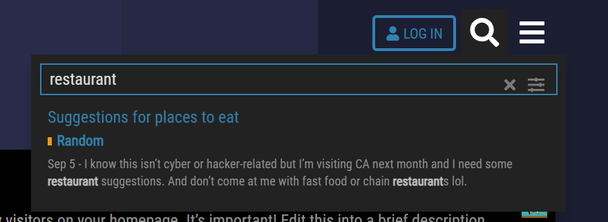
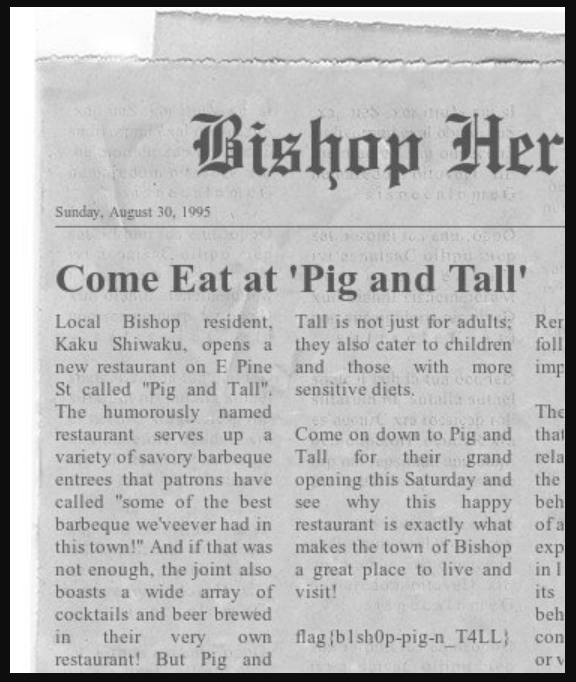

# Fine Dining
Fine Dining is an osint challenge. We know that a member talked about how their dad owned a restaurant in Ghost Town. We need to find out where the restaurant is located and where the member may have lived.

## Ghost Town
The first thing we did was Google search for `Ghost Town DEADFACE`.

## Ghost Town Restaurant Search
Then once on the Ghost Town website, we used the search bar to search for `restaurant`.

## Post
Then we looked at the messages on the Ghost Town forum and saw this one about a newspaper article.

## Flag
> flag{b1sh0p-pig-n_T4LL}

We then looked at the newspaper article and found the flag.

