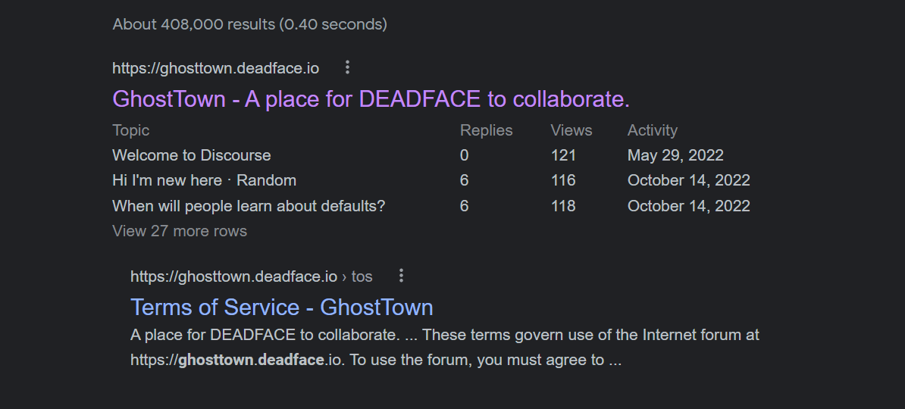
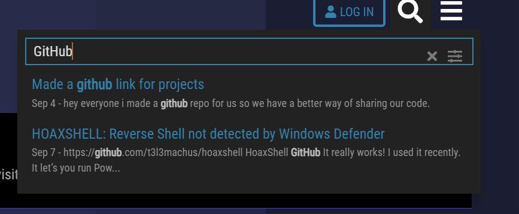
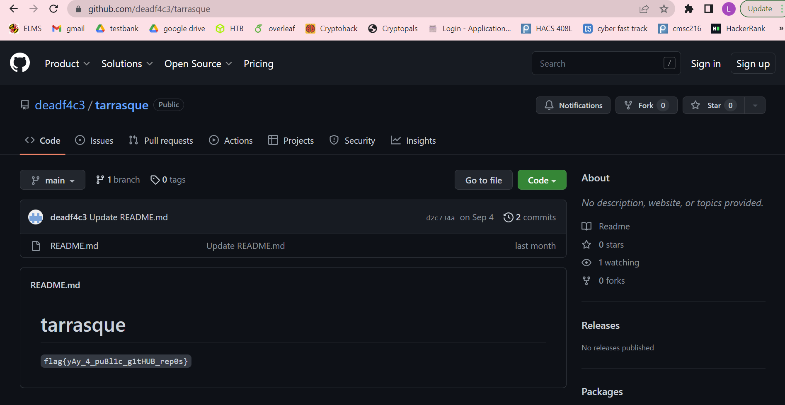

### UNDER PUBLIC SCRUTINY
DEADFACE mentioned on Ghost Town that they have a public GitHub repository. See if you can find a flag hidden that belongs to DEADFACE.

Submit the flag as: `flag{flag-text}`.

---

#### Ghost Town
The first thing we did was Google search for `Ghost Town DEADFACE`.

Once we went to the Ghost Town website, the next thing we did was search for GitHub. 

Next we looked at the first search result and read the entire thread. We noticed that user `bumpyhassan` said that the account is `deadf4c3`. 

---

#### GitHub
Then we went to `www.github.com/deadf4c3`.

---

#### Flag
> flag{yAy_4_publ1c_g1tHUB_rep0s}

We noticed they had one repository `tarrasque`. We chose that repository and found the flag.

---