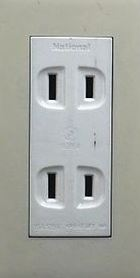
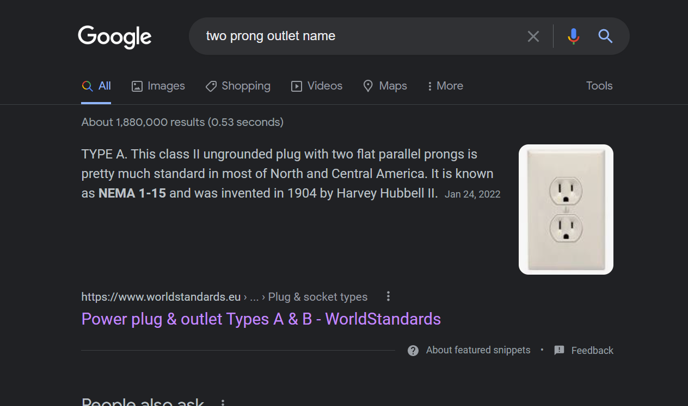

# Japen Electric
Japen Electric is an osint challenge where we have to find the type of outlet as in the provided picture: 

## Flag
> t3n4ci0us{A_outlet}

First we google `two prong outlet name` and find the outlet in the picture is a `Type A` outlet:

