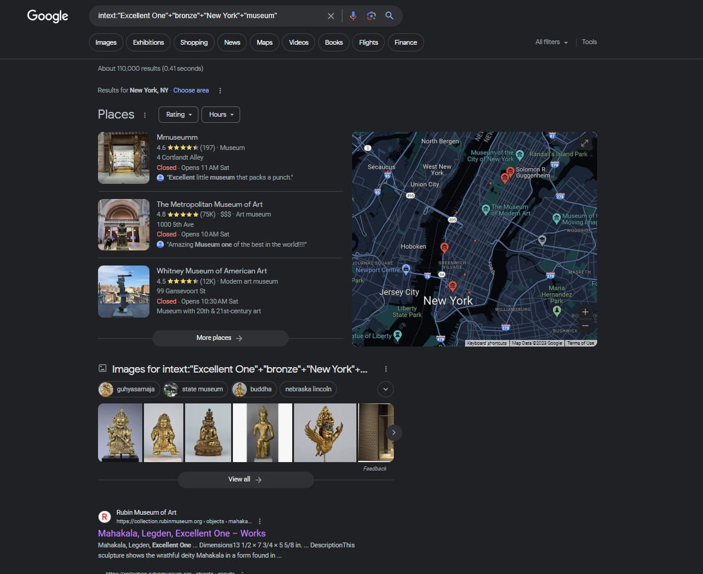
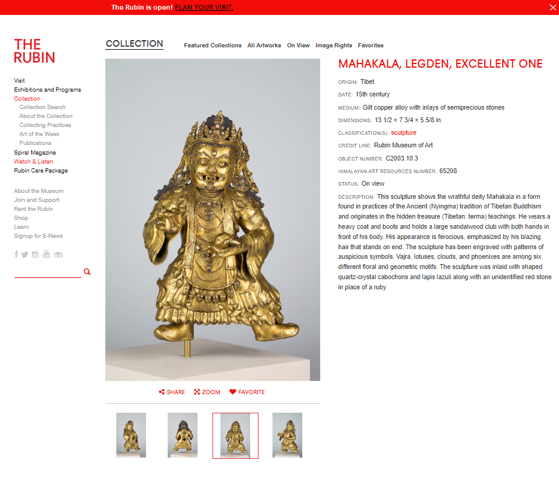

### Finding Artifacts 1
David is on a trip to collect and document some of the world’s greatest artifacts. He is looking for a coveted bronze statue of the "Excellent One" in New York City. What museum is this located at? The flag format is the location name in lowercase, separated by underscores. For example: `uiuctf{statue_of_liberty}`

---

#### Search
First we use Google Dork Operators to search for the the statue. We use the `intext` operator to search websites for phrases:

We decide to look further into the first website. 

---

#### Flag
> uiuctf{rubin_museum_of_art}

---