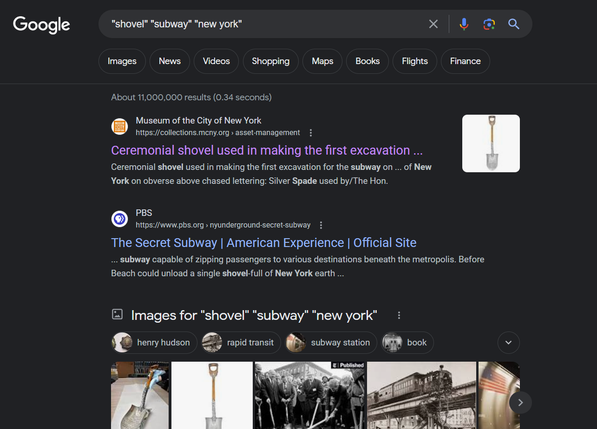
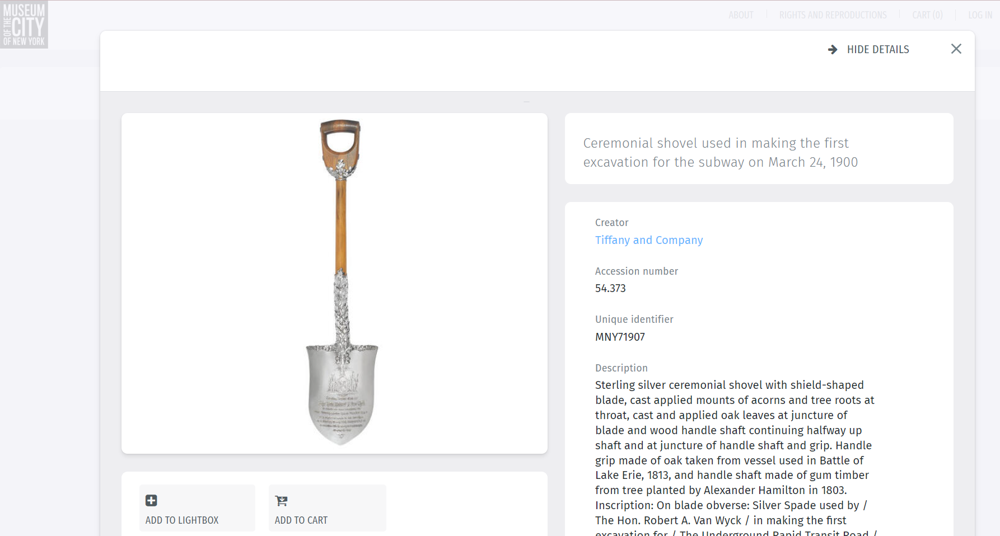

# Finding Artifacts 2
New York City is known for its sprawling subway system. However, none of that would have been possible without modern earth-moving equipment. Find where the first ever shovel was used to start digging the subway. Flag format should be in `uiuctf{name_of_museum}`.

---

#### Search
First we use double quotes to search for key phrases:

We decide to look further into the first website that Google located. 

---

#### Flag
> uiuctf{museum_of_the_city_of_new_york}

---