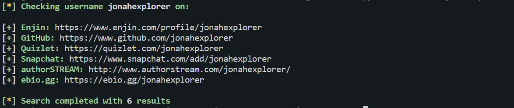
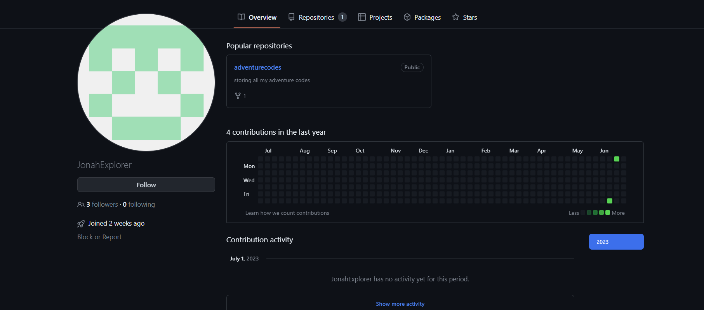
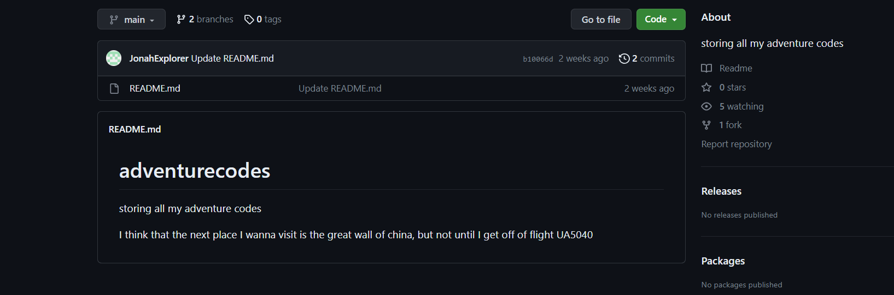
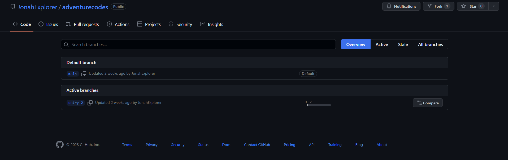
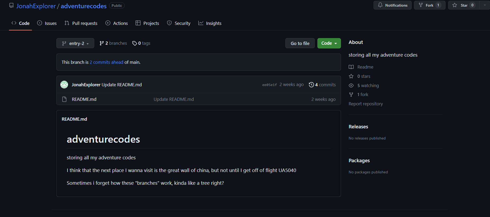
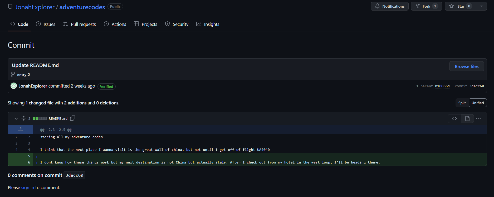

### Jonah's Journal
After dinner, Jonah took notes into an online notebook and pushed his changes there. His usernames have been relatively consistent but what country is he going to next? Flag should be in format` uiuctf{country_name}`

---

#### Sherlock
In Whats for Dinner, we found that Jonah's Twitter username is `@jonahexplorer`. Using Sherlock, we check if he has reused this username across other websites:

---

#### GitHub

There is a GitHub account with a matching username:

We look at the only repository:

The repository has two branches:

We notice that the entry-2 branch is 2 commits ahead of main:

We look at old commits and notice the next country Jonah is going to is Italy.

---

#### Flag
> uiuctf{italy}

---