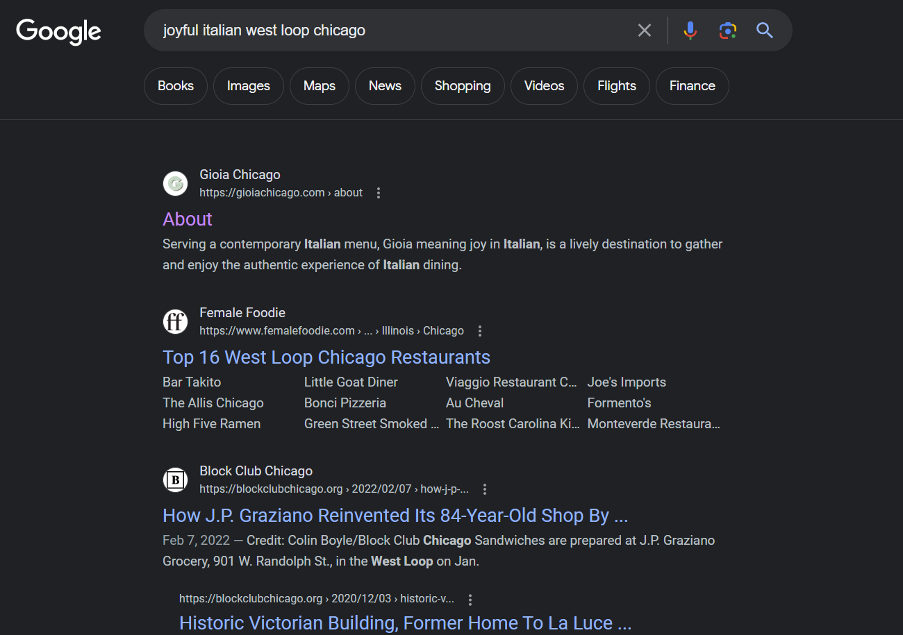
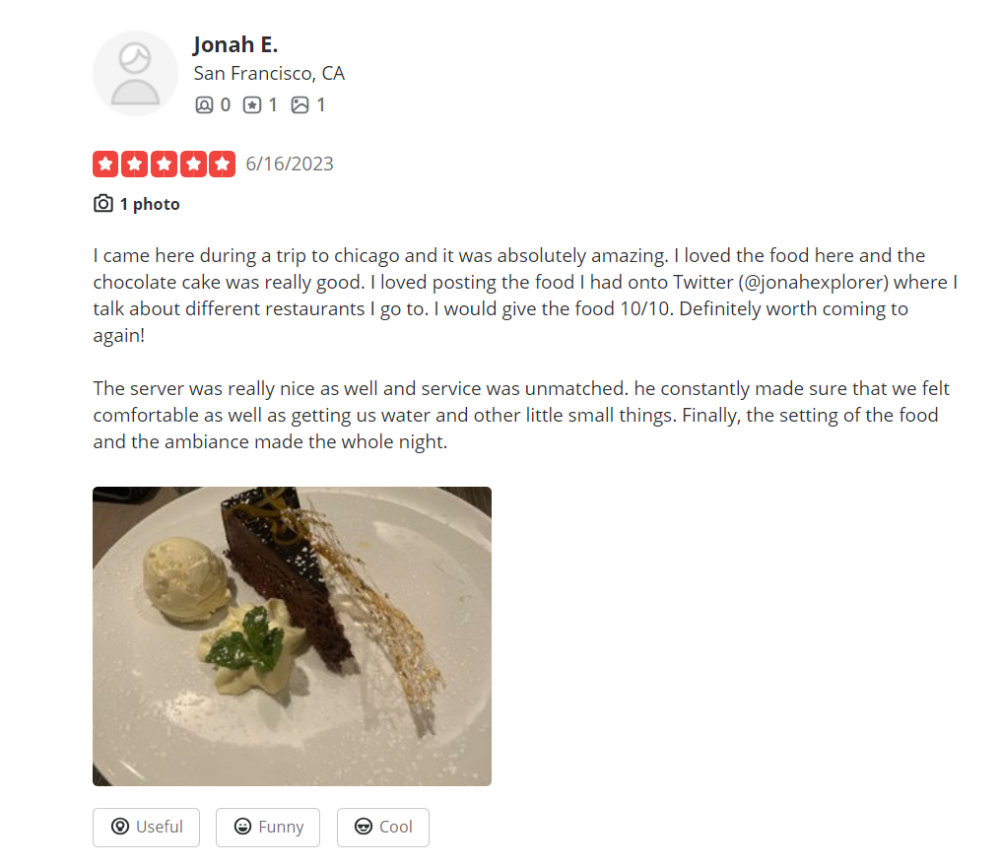

### What's For Dinner?
Jonah Explorer, world renowned, recently landed in the city of Chicago, so you fly there to try and catch him. He was spotted at a joyful Italian restaurant in West Loop. You miss him narrowly but find out that he uses a well known social network and and loves documenting his travels and reviewing his food. Find his online profile.

---

#### Initial Google Search
First we search for an Italian restaurant in West Loop, Chicago. However, there appears to be many Italian restaurants there. We notice that the challenge described the restaurant as `joyful`, so we try the search again :

---

#### Yelp Search
After finding the Gioia Restaurant, we know that Jonah may have eaten there and left a review. We find the Gioia Restaurant on Yelp which is listed as Gioia Ristorante Pastificio (a slightly different name). We then check the reviews and we find a review by Jonah E:

---

#### Twitter
The Yelp review mentions his Twitter account: `@jonahexplorer`. So we search for this Twitter account and notice that it has the flag posted on it.

---

#### Flag
> uiuctf{i_like_spaghetti}

---