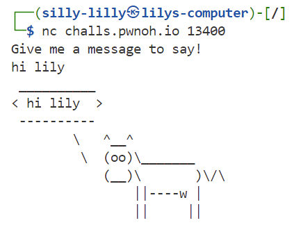
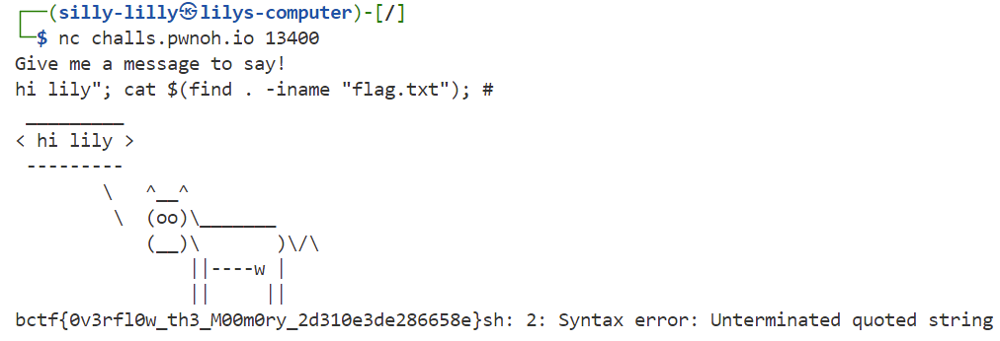

### runway0
If you've never done a CTF before, this runway should help!

Hint: MacOS users (on M series) will need a x86 Linux VM. Tutorial is here: [pwnoh.io/utm](https://pwnoh.io/utm)

`nc challs.pwnoh.io 13400`<br>

Challenge Files: [runway0.c](runway0.c)

---

#### Server
The server reads our supplied message and repeats it back to us:



The `runway0.c` file contains the code running on the server. The server takes in our supplied message, encloses it in double quotes, and appends it to the string "cowsay". It then executes the resulting command using a syscall:

```C
// runway0.c main()
char command[110] = "cowsay \"";
char message[100];

printf("Give me a message to say!\n");
fflush(stdout);

fgets(message, 0x100, stdin);

strncat(command, message, 98);
strncat(command, "\"", 2);

system(command);
```

---

#### Command Injection
Since the server uses a system call to execute the cowsay command, we can inject additional commands by chaining them to the cowsay command. The cowsay command processes an input string enclosed in quotation marks. By supplying an additional closing quotation mark in our input, we can terminate the string early. We then append a semicolon to chain a command to read the contents of the `flag.txt` file, and use `#` to comment out any remaining input or syntax that might cause errors."

```C
// runway0.c syscall call with code injection
exec(cowsay "hi lily"; cat $(find . -iname "flag.txt"); # ");
```

---

#### Flag
> bctf{0v3rfl0w_th3_M00m0ry_2d310e3de286658e}



---