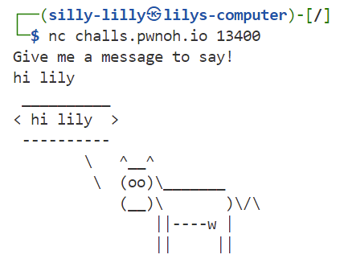
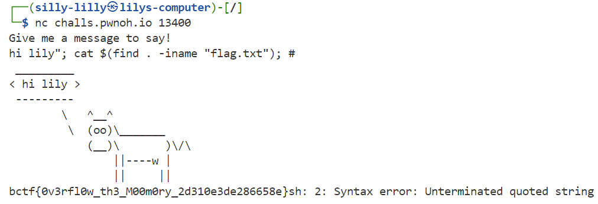

# runway0
runway0 is a beginner-pwn challenge focusing on code injection. We are given a server that we send a message and a cow will send the message back:



## Challenge Files
We are given the `runway0` directory that contains a `runway0.c` file and more files used to host the server. Looking at the main class in `runway0.c`, we see that the string `command` is initialized to `cowsay "`. Then the server reads our supplied message `{message}` and adds it to the command string `cowsay "{message}`. Lastly, the server encloses our supplied message with a quotation mark `cowsay "{message}"` before executing the command using a syscall:

```C
#include <stdio.h>
#include <stdlib.h>
#include <string.h>

int main() {
    char command[110] = "cowsay \"";
    char message[100];

    printf("Give me a message to say!\n");
    fflush(stdout);

    fgets(message, 0x100, stdin);

    strncat(command, message, 98);
    strncat(command, "\"", 2);

    system(command);
}
```

## Command Injection
Since the `cowsay` command reads a string enclosed by two quotation marks, we can make the cowsay command read our message `hi Lily"` until there is a quotation mark. We can use a semicolon to chain bash commands. After the `cowsay` command executes, we search for a file named `flag.txt` and read its contents. Lastly we use a `#` to comment out the remaining text. This entire command we supply to the server is then executed in the syscall:

```C
    exec(cowsay "hi lily"; cat $(find . -iname "flag.txt"); # ");
```

## Flag
> bctf{0v3rfl0w_th3_M00m0ry_2d310e3de286658e}

