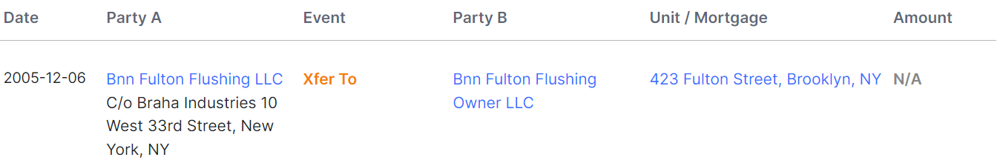

# Authentic Chinese Food
Authentic Chinese Food is an osint challenge where we are given an image of a Panda Express. We need to find the health grade of the restaurant, the year the building was built, and the LLC that owns the building.

# Panda Express Location
We can search for Panda Express locations on their [website](https://www.pandaexpress.com/locations). We notice that the locations are organized by state and try searching just for Panda Expresses only in [New York State](https://www.pandaexpress.com/locations/ny). Since there are only 20 Panda Expresses in New York State, we can try looking through at each of New York Locations. 

We notice that the Panda Express located at `423 Fulton Street, Brooklyn, NY, 11201` looks like the Panda Express from the challenge image.

# Health Grade
We find the [Yelp page](https://www.yelp.com/biz/panda-express-brooklyn-14) for the Panda Express located on Fulton Street. Scrolling down to the Amenities and More section, we see the Health Score is `Grade Pending`.

# Year Built
A google search of the Panda Express address `423 Fulton Street, Brooklyn, NY, 11201`, yields an [architecture article](https://www.brownstoner.com/architecture/building-of-the-day-423-fulton-street/) about the building. According to the article, the building was built in `1931`.

# Building Owner
Lastly, we search for `realty hop 423 Fulton Street` and find the [property records for `Bnn Fulton Flushing Llc`](https://www.realtyhop.com/property-records/new-york-ny/search/bnn-fulton-flushing-llc). The record shows us that the property was most recently sold to `Bnn Fulton Flushing Owner LLC`.

# Flag
> csawctf{Grade_Pending_1931_Bnn_Fulton_Flushing_Owner}