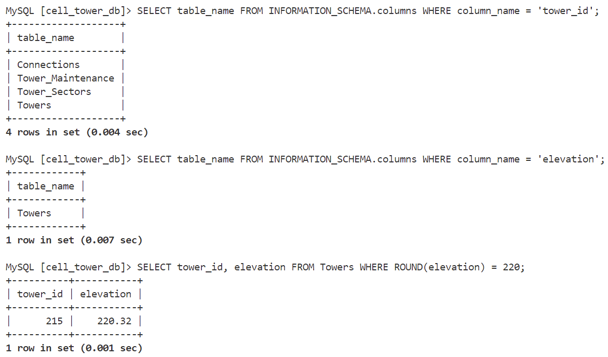

# SkyWave 1: High Tower

SkyWave 1: High Tower is a SkyWave challenge focusing on MariaDB. We need to find the tower_id of the cell tower that sits at an approximate elevation of 220 ft.

## Flag

> flag{215}

First we find the table that contains the `tower_id` and `elevation` columns:

```SQL
SELECT table_name FROM INFORMATION_SCHEMA.columns WHERE column_name = 'tower_id';
SELECT table_name FROM INFORMATION_SCHEMA.columns WHERE column_name = 'elevation';
```

The table with the `tower_id` columns and `elevation` columns is named `Tower`. Next we get the `tower_id` of the tower who's elevation is 220:

```SQL
SELECT tower_id, elevation FROM Towers WHERE ROUND(elevation) = 220;
```

The flag format is `flag{tower_id}`. So the flag is `flag{215}`:

