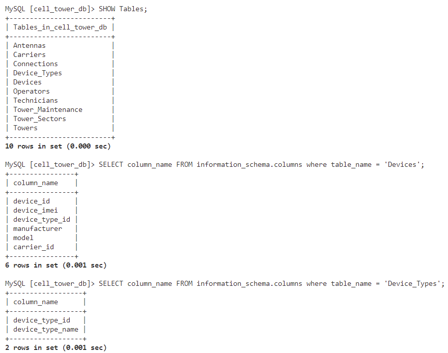
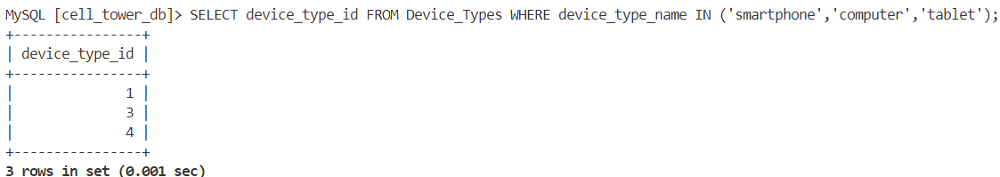
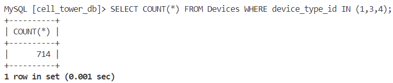

# SkyWave 2: Trifecta
SkyWave 2: Trifecta is a SkyWave challenge focusing on SQL. We need to count the number of devices that are in the database are either a smart phone, a computer, or a tablet.

## Flag
> flag{714}

First we look at the tables in the Database and see there's tables named `Device` and `Device_Types`.

```SQL
SHOW Tables;
```

Next We look at the columns of the `Device` and `Device_Types` tables:

```SQL
SELECT column_name FROM information_schema.columns where table_name = 'Devices';
SELECT column_name FROM information_schema.columns where table_name = 'Device_Types';
```

We see that the `Devices` table has a `device_type_id` column and the `Device_Types` table has `device_type_id` and `device_type_name` columns:



We want to count the number of smartphones, computers, and tablets in the `Devices` table. First we need to get the `device_type_id` of these devices from the `Device_Types` table:

```SQL
SELECT device_type_id FROM Device_Types WHERE device_type_name IN ('smartphone','computer','tablet');
```

We see that the `device_type_id` of smartphones, computers, and tablets are `1`, `3`, and `4`. 



We count the number of rows in the `Devices` table where the `device_type_id` is `1`, `3`, or `4`:

```SQL
SELECT COUNT(*) FROM Devices WHERE device_type_id IN (1,3,4);
```

The flag format is `flag{number}`, so the flag is `flag{714}`:

