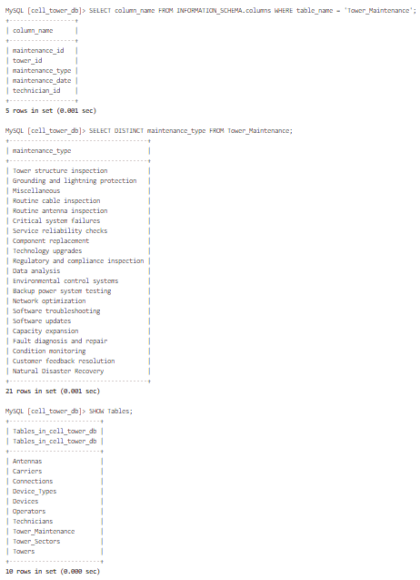
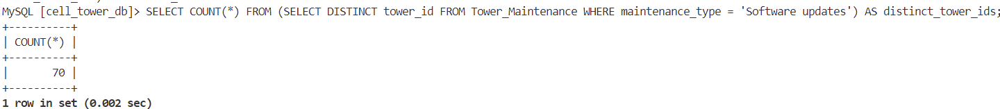

# Challenge Name 
SkyWave 9: Updates is a SkyWave challenge focusing on MariaDB. We need to find the number of towers that received software updates.

## Flag
> flag{70}

We look at all the tables in the `cell_tower_db` database:

```SQL
SHOW Tables;
```

We see there is a `Tower_Maintenance` table and list the columns of this table:

```SQL
SELECT column_name FROM INFORMATION_SCHEMA.columns WHERE table_name = 'Tower_Maintenance';
```

We see that the `Tower_Maintenance` has `maintenance_type` and `tower_id` columns. We list the distinct `maintenance_type` values:

```SQL
SELECT DISTINCT maintenance_type FROM Tower_Maintenance;
```

We see that there is a `maintenance_type` value `Software updates`:



We filter the `Tower_Maintenance` table to only rows where the value of `maintenance_type` is `Software updates`. Next we count the rows with a distinct `tower_id` since towers that have had multiple software updates should only be counted once:

```SQL
SELECT COUNT(*) FROM (SELECT DISTINCT tower_id FROM Tower_Maintenance WHERE maintenance_type = 'Software updates') AS distinct_tower_ids;
```

The flag format is `flag{number}` and our flag is `flag{70}`:

