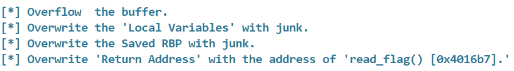
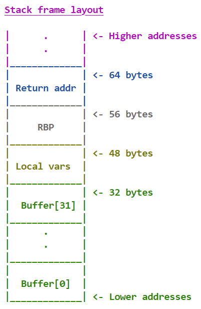
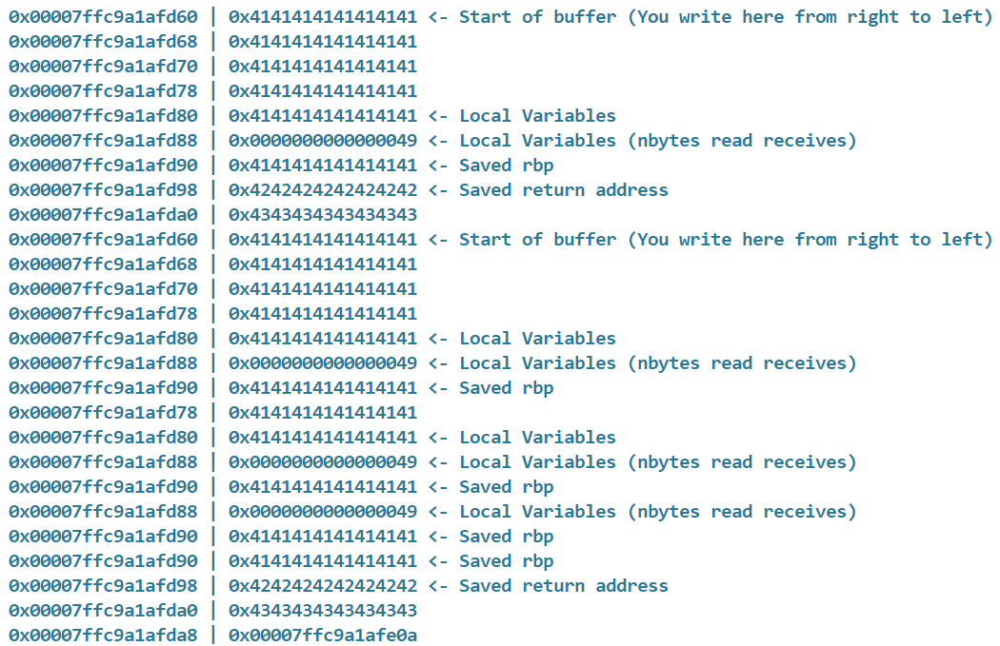

### El Mundo
You may not control time, but you can certainly control the flow of your program! Use your stand to bend it to your will!

Challenge File: [solver.py](solver.py)

---

#### Getting the Offset
Using netcat, we access the challenge instructions:



We see that we need to overwrite the buffer, local variables, and RBP with junk values. We also need to overwrite the return address with `0x4016b7`. We can use netcat to access a stack frame layout:



We see that the buffer is 32 bytes, the local vars are 16 bytes, the RBP is 8 bytes, and the return address is 8 bytes. The offset should be `56 = 32+16+8` bytes and the return address `8` bytes. We can confirm this by passing netcat the string `56*A+8*B+8*C`:



We see that the buffer, local variables, and RBP are all filled with `0x41` which is the byte value of the character `A`. We see that the return address is filled with `0x42` which is the byte value of the character `B`. We also see that the 8 bytes under the return address is filled with `0x43` which is the byte value of the character `C`. Therefore the offset is `56` bytes.

---

#### Overwriting the return address
We want to return to the return address of the `read_flag()` function which is `0x4016b7`. We need 56 bytes of junk followed by the return address of the `read_flag()` in little endian format. Additionally, we need 5 bytes of padding because the return address is only 6 bytes:

<center>Junk[56]+b716400000000000</center>

---

#### Flag
> HTB{z4_w4rud0o0o0o0_a98429aef80cc5c2252d60cf9357f0f4}

We use the `solver.py` challenge file to interact with the server. We make sure the program isn't running locally and update the IP and Port to match the challenge IP and Port:

```python
# solver.py
LOCAL = False

...

IP   = str(sys.argv[1]) if len(sys.argv) >= 2 else '{CHALLENGE IP}'
PORT = int(sys.argv[2]) if len(sys.argv) >= 3 else {CHALLENGE PORT}
```

Lastly we change the offset and return address:

```python
# solver.py
nbytes = 56
read_flag_addr = 0x4016b7
```

---