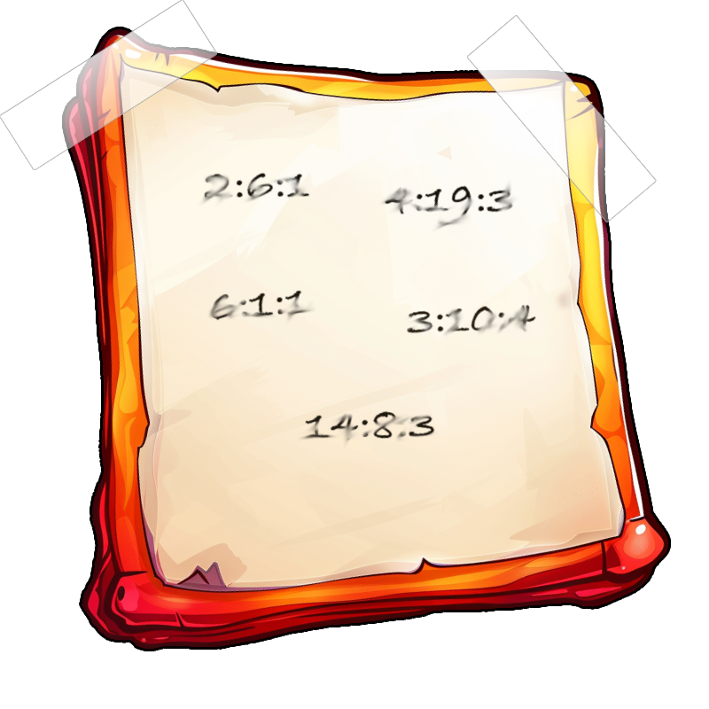

### Frosty Keypad
In a swirl of shredded paper, lies the key. Can you unlock the shredder’s code and uncover Santa's lost secrets?<br>
Solved: Silver, Gold

---

***Morcel Nougat***
> Hello again! I'm Morcel Nougat, dashing around like a reindeer on a sugar rush! We've got a bit of a dilemma, and I could really use your expertise.<br><br>
Wombley and Alabaster have taken charge now that Santa’s gone missing, and We're scrambling to get the Wish List secured. But... one of the elves in the Data Management Team got overzealous, and the Shredder McShreddin 9000 gobbled up a crucial document we need to access Santa's chest!<br><br>
It’s our golden ticket to getting Santa’s Little Helper tool working properly. Without it, the hardware hack we're planning is as empty as Santa’s sleigh in January.<br><br>
Think you can help? I can get you into the Shredder McShreddin 9000’s inner workings to retrieve the pieces, but there are two access codes involved. One of the elves left a hint, but it’s all a blur to me!<br><br>
I've noticed that some elves keep referring to a certain book when they walk by. I bet it has the answers we need to crack the code and recover the document!<br><br>
You know, some of the elves always have their noses in the same book when they pass by here. Maybe it’s got the clues we need to crack the code?<br><br>

---

<br>We pickup the book and flashlight near the Frosty Keypad:<br><br>

<div style="display: flex; align-items: flex-start; gap: 10px;">
    <div style="flex-shrink: 0;">
        
    </div>
    <div style="flex-grow: 1;">
        <div style="font-weight: bold; font-style: italic;">Frosty Book</div>
        <div style="margin-top: 5px; font-size: 0.9em; line-height: 1.5;">
            <span style="font-size: 16px; border-bottom: none; margin-bottom: 10px;">A snow-covered book lies forgotten on the ground, its pages slightly ajar as if inviting the curious to unlock the secret hidden within its well-worn spine.<br><br><a href ="https://frost-y-book.com/">Read the Book...</a></span>
        </div>
    </div>
</div><br><br>

<div style="display: flex; align-items: flex-start; gap: 10px;">
    <div style="flex-shrink: 0;">
        
    </div>
    <div style="flex-grow: 1;">
        <div style="font-weight: bold; font-style: italic;">UV Flashlight</div>
        <div style="margin-top: 5px; font-size: 0.9em; line-height: 1.5;">
            <span style="font-size: 16px; border-bottom: none; margin-bottom: 10px;">A trusty flashlight, twinkling with holiday cheer, perfect for illuminating hidden...prints...and rogue reindeer tracks!</span>
        </div>
    </div>
</div>

---

#### Silver Solution
> 72682

We read the note on the left of the Frosty Keypad:

<div style="display: flex; align-items: flex-start; gap: 10px;">
    <div style="flex-shrink: 0;">
        
    </div>
    <div style="flex-grow: 1;">
        <div style="font-weight: bold; font-style: italic;">Note</div>
        <div style="margin-top: 5px; font-size: 0.9em; line-height: 1.5;">
            <span style="font-size: 16px; border-bottom: none; margin-bottom: 10px;">The note provides instructions on how to extract the pin from the Frosty Book. The key is in the format of <code>page:word:character</code>.</span>
        </div>
    </div>
</div>

<br><br>We map each encoded digit of the pin to a corresponding character in the Frosty Book:

```python
# soln.py solve_silver()
for ct in cts:

    p,w,c = ct

    page = book[p]
    page = page.split()

    word = page[int(w)-1]
    word = re.sub(r'[^\w\s]', '',word)

    character = word[int(c)-1]
    pts+=character
```

We get the codeword `SANTA`:

```
(2:6:1)  -> SNUG    -> S
(4:19:3) -> WHAT    -> A
(6:1:1)  -> NOW     -> N
(3:10:4) -> CLATTER -> T
(14:8:3) -> TEAM    -> A
```

To get the numeric pin from the codeword, we map each letter to its corresponding number key based on the traditional mobile phone layout:

```python
# soln.py solve_silver()
 for pt in pts:
    for number, letters in phone_mapping.items():
        if pt in letters:
            pin+=number
```

We get the Pin `72682`:

```
S -> 7
A -> 2
N -> 6
T -> 8
A -> 2
```

---

***Morcel Nougat***
> Incredible work! You pieced together the code like a true sleuth and retrieved the shreds we need. I’m not quite sure how you’ll put them all together, but if anyone can, it’s you!

---

### Gold Solution
> 22786

Looking at the source code, we see that there are 10 possible numeric values for each of the digits of the pin:

```JavaScript
// index.html
const keys = [
    '1', '2', '3',
    '4', '5', '6',
    '7', '8', '9',
    'Clear', '0', 'Enter'
];
```

We also see that there are 5 digits in the pin:

```JavaScript
// index.html
const maxDigits = 5; //max # digits in code
```

We can brute-force the pin by iterating through all 10 possible values (0-9) for each of the 5 digits:

$$
10*10*10*10*10 = 100000 \text{ Attempts}
$$

Looking at the source code, we see that the the flashlight will show fingerprints on 4 buttons (2,7,6,8):

```JavaScript
// index.html
const keysToCheck = ['2', '7', '6', '8', 'Enter'];
```

We can optimize our brute-force solution by only checking pins containing the 4 values:

$$
4*4*4*4*4 = 1024 \text{ Attempts}
$$

Additionally, since the pin is 5 digits long and needs to contain each of the 4 values, one value will repeat and the rest will occur once. We treat the repeating value as an additional 5th value (2,6,7,8,r) and then account for repetition:

$$
5×4×3×2×1 = 120 \text{ Attempts}
$$

The repeating value's first occurrence is indistinguishable from its second one:

$$
\frac{5×4×3×2×1}{2×1} = 60 \text{ Attempts}
$$


First we choose the value to be used twice: 

```python
# soln.py solve_gold()
for rep_button in buttons: # Chooses Button to Repeat

    leftover_buttons = [i for i in buttons if i != rep_button]
```

Next we choose the two digits in the pin which are the repeating value:

```python
# main.py
all_rep_digits = list(itertools.combinations(digits, 2))

for rep_digit in all_rep_digits: # Chooses Digits in Passcode With Repeating Button

    rep_digit1,rep_digit2 = rep_digit
    attempt[rep_digit1] = rep_button
    attempt[rep_digit2] = rep_button

    leftover_digits = [i for i in digits if i != rep_digit1 and i != rep_digit2] 
```

Lastly, we need to choose the order of the buttons to push for our non-repeating digits:

```python
# main.py
all_perm = list(itertools.permutations(leftover_buttons))
            
for perm in all_perm:

    button1, button2, button3 = perm # Order of the Non-Repeating Buttons
    attempt[leftover_digits[0]] = button1
    attempt[leftover_digits[1]] = button2
    attempt[leftover_digits[2]] = button3
```

Now we run the code to find that `22786` returns an HTTP Response success status code:

```python
# main.py
data["answer"] = num

# Send the POST request
response = requests.post(url, json=data)
time.sleep(1)

if response.status_code == 200: # success code
    print(num)
    return
```

---

***Morcel Nougat***
> Unbelievable! You found a flaw in the system and completely bypassed the rate limiter. You’re practically an elf legend!<br><br>
Your help has been absolutely essential, especially now with Santa missing. Wombley and Alabaster will want to hear all about it—go share the news with Jewel Loggins!

---