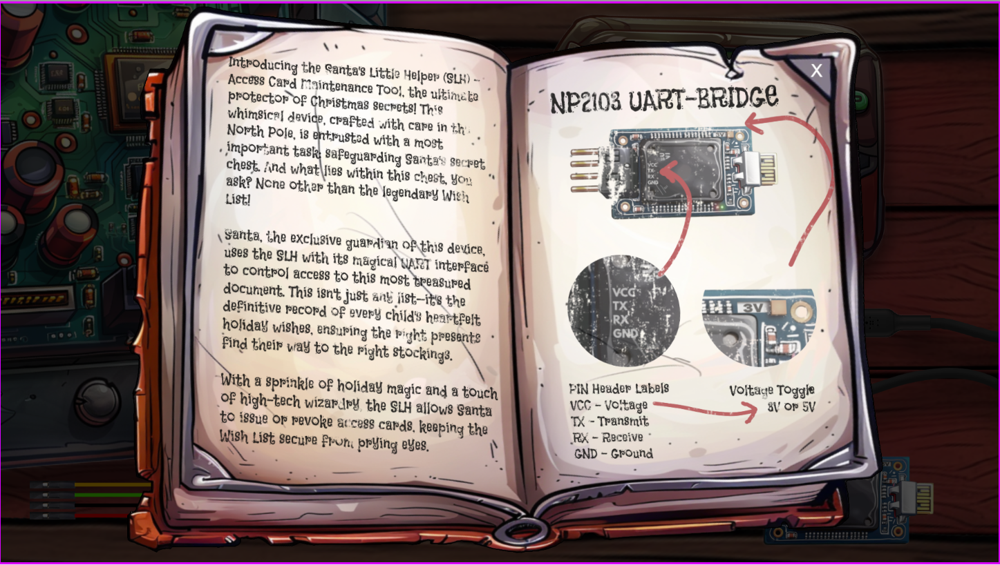
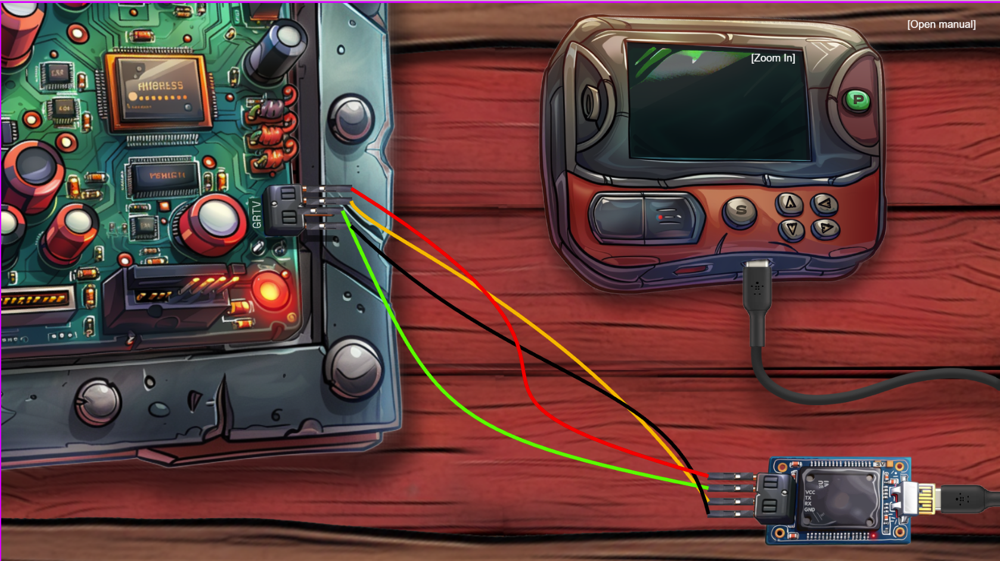
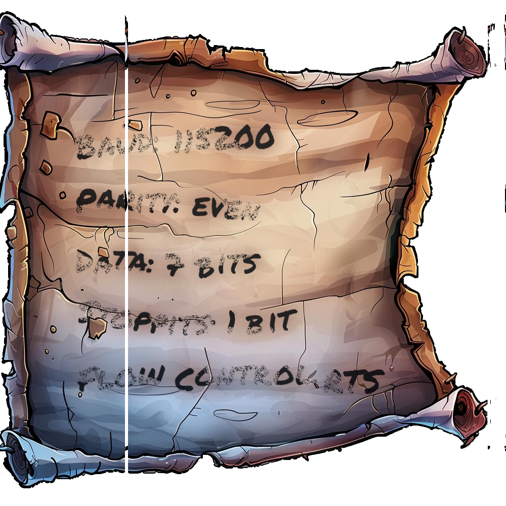
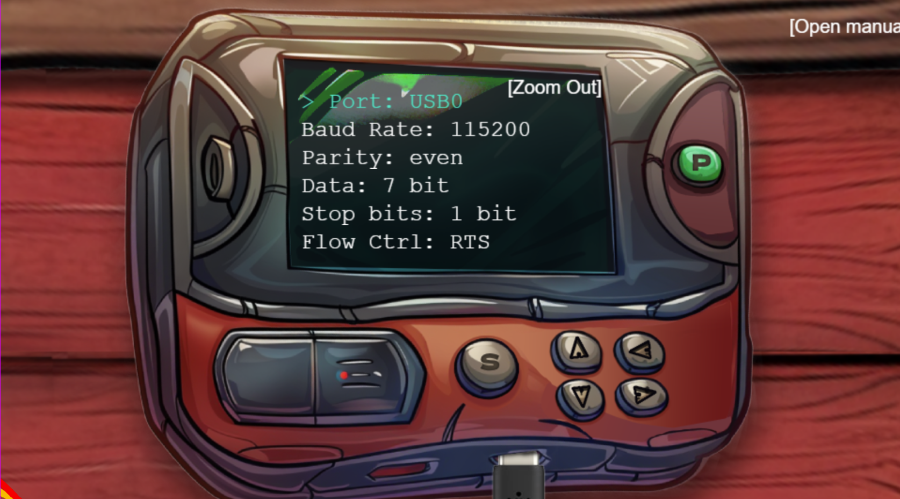

### Hardware Hacking 101 Part 1
Difficulty: 1/5<br>
Solved: Silver, Gold

---

### Introduction

*Jingle all the wires and connect to Santa's Little Helper to reveal the merry secrets locked in his chest!*

---

#### Hints

***On the Cutting Edge***<br>
From: Morcel Nougat<br>
Hey, I just caught wind of this neat way to piece back shredded paper! It's a fancy heuristic detection technique—sharp as an elf’s wit, I tell ya! Got a sample Python script right here, courtesy of Arnydo. Check it out when you have a sec: [heuristic_edge_detection.py](https://gist.github.com/arnydo/5dc85343eca9b8eb98a0f157b9d4d719).

---



---

After completing Frosty Keypad, we receive shredded pieces of paper:

<div style="display: flex; align-items: flex-start; gap: 10px;">
  <div>
    
  </div>
  <div>
    <p><b>One Thousand Little Teeny Tiny Shredded Pieces of Paper</b></p>
    <p>A mountain of one thousand little tiny <a href="slices/">shredded pieces of paper</a>—each scrap whispering a secret, waiting for the right hardware hacker to piece the puzzle back together!</p>
  </div>
</div>

---

#### Silver Objective
According to the manual, we need to make a NP2103 UART Bridge:

```
[Host Device]  <--USB-->  [UART Bridge]  <--UART-->  [Target Device]
```

In order to make the UART Bridge. We need to:
1. Connect the UART Bridge and the Target Device
2. Connect the UART Bridge and the Host Device
3. Configure the Host Device

---

#### Silver Solution
##### Connecting the UART Bridge and the Target Device



We connect the wires between the <b>UART Bridge</b> and the <u>Target Device</u>:

- Black Ground Wire: <b>GND</b> and <u>G</u>
- <span style="color: green"> Green Receive: <b>TX</b> and <u>R</u></span>
- <span style="color: orange">Orange Transmit: <b>RX</b> and <u>T</u></span>
- <span style="color: red">Red Voltage: <b>VCC</b> and <u>C</u></span>

Note that the wires must connect the <span style="color:green"><b>UART Bridge's Transmit Pin TX</b> to the <u>Target Device's Receive Pin</u></span> and the <span style="color:orange"><b>UART Bridge's Receive Pin RX</b> to the <u>Target Device's Transmit Pin T</u></span> to allow the devices to communicate.

##### Connecting the UART Bridge and the Host Device

We connect the USB on the UART Bridge to the one on the Host Device. Next we toggle the voltage from 5V to 3V and connect the usb.

##### Configuring the Host Device
We can recover an image of the settings using the slices folder of images and by altering [heuristic_edge_detection.py](https://gist.github.com/arnydo/5dc85343eca9b8eb98a0f157b9d4d719).

The original `heuristic_edge_detection.py` code loads all of the 1000 slice images into the `slices` array. Each slice image `slices[i]` is a column of the image and has 1000 rows, 1 column, and 3 RGB pixels. Next the code compares each unmatched slice `slice1` with the remaining unmatched slices `slice2` and matches the `slice2` that minimizes the edge difference between the two slices. Lastly, the code reassembles and saves the final image `assembled_image.png`. 

Originally, the `heuristic_edge_detection.py` code gives us an image that is reversed and cut in half:


The original code gives us the ordering of the slices, but doesn't find the first slice of the original image. We need to get all the white space to one side of the image. We look through our matched slices `matched_slices` and start the matched array `shifted_array` at the the last all white column:

```python
# heuristic_edge_detection.py
def find_first_col(matched_slices):

    n = len(matched_slices)

    for i in range(0,n):
 
        if np.all(np.all(matched_slices[i][:, 0] == [255, 255, 255], axis=1)):

            shifted_array = np.roll(matched_slices, shift=i, axis=0)
            matched_slices = shifted_array
            
    return matched_slices
```

Next we reverse our image before saving it:

```python
# heuristic_edge_detection.py
def save_image(images, output_path):
    heights, widths, _ = zip(*(i.shape for i in images))

    total_width = sum(widths)
    max_height = max(heights)
    
    new_image = Image.new('RGB', (total_width, max_height))

    x_offset = 0
    for img in images:
        pil_img = Image.fromarray(img)
        new_image.paste(pil_img, (x_offset, 0))
        x_offset += pil_img.width

    new_image = new_image.transpose(method=Image.FLIP_LEFT_RIGHT) # Added
    new_image.save(output_path)
```

We have recovered the image:



Now we enter these configuration settings:



---

***Jewel Loggins***
> Fantastic! You managed to connect to the UART interface—great work with those tricky wires! I couldn't figure it out myself…<br><br>
Rumor has it you might be able to bypass the hardware altogether for the gold medal. Why not see if you can find that shortcut?

---

#### Gold Solution

We can use the `main.js` source code to solve the challenge. The `checkConditions()` function in the source code, evaluates if the game has been won. If `this.uV` is `3`, it sends `this.uV` and an array `[this.currentPortIndex, ...]` to the `checkit()` function. If the `checkit()` is true, then the game is won:

```javascript
// main.js checkConditions()

if (this.uV === 3 && this.allConnectedUp && !this.usbIsAtOriginalPosition || this.dev) {
    // console.log("PARTY TIME");
    let checkIt = await checkit([this.currentPortIndex, this.currentBaudIndex, this.currentParityIndex, this.currentDataIndex, this.currentStopBitsIndex, this.currentFlowControlIndex], this.uV)
    if (checkIt) {
        this.popup("success! loading bootloader...\nGo speak with Jewel Loggins for the next step!");
        this.yippee.play();
    } else {
        this.merp.play();
        this.popup("Serial connection couldn't be established...\nPlease check your settings and try again.");
    }

    // window.open('https://www.anotherexample.com', '_blank'); // Replace with your desired URL
    return true;
}
```

The `checkit()` function makes an HTTP POST Request to the `api/v2/complete` endpoint with a Header `Content-Type: application/json` and JSON data `requestID`, `serial`, and `voltage`. Additionally it used to use the `api/v1/complete` endpoint which "should" be removed by now, but isn't:

```javascript
// main.js checkit()

// Build the URL with the request ID as a query parameter
// Word on the wire is that some resourceful elves managed to brute-force their way in through the v1 API.
// We have since updated the API to v2 and v1 "should" be removed by now.
// const url = new URL(`${window.location.protocol}//${window.location.hostname}:${window.location.port}/api/v1/complete`);
const url = new URL(`${window.location.protocol}//${window.location.hostname}:${window.location.port}/api/v2/complete`);

const response = await fetch(url, {
    method: 'POST',
    headers: {
        'Content-Type': 'application/json'
    },
    body: JSON.stringify({ requestID: requestID, serial: serial, voltage: uV })
});

```

Additionally, in the `main.js create()` function, we find arrays for the settings.

```javascript
// main.js create()
const baudRates = [300, 1200, 2400, 4800, 9600, 14400, 19200, 38400, 57600, 115200];
const dataBits = [5, 6, 7, 8];
const parityOptions = ["None", "odd", "even"];
const stopBits = [1, 2];
const flowControlOptions = ["None", "RTS/CTS", "Xon/Xoff", "RTS"];
const ports = ["COM1", "COM2", "COM3", "USB0"];
```

We use the settings from solving the silver challenge:

```
Port = USB0
Baud Rate = 115200
Parity = even
Data = 7
Stop Bits = 1
Flow Control = RTS
```

Now we get the index of the correct setting from each of the arrays:

```
Port Index = 3
Baud Rate Index = 9
Parity Index  = 2
Data Index = 2
Stop Bits Index = 0
Flow Control Index = 3
```

We make an HTTP POST Request to the `/api/v1/complete` endpoint using the header from the `checkit()` function and the indices we found above. We set the values in `serial` to `[3, 9, 2, 2, 0, 3]` the indices corresponding `voltage` to `3`. Additionally we set the `requestID` to our own id:

```
curl -X POST -H "Content-Type: application/json" -d '{"requestID": "{OUR ID}", "serial": [3, 9, 2, 2, 0, 3], "voltage": 3}' https://hhc24-hardwarehacking.holidayhackchallenge.com/api/v1/complete
```

---