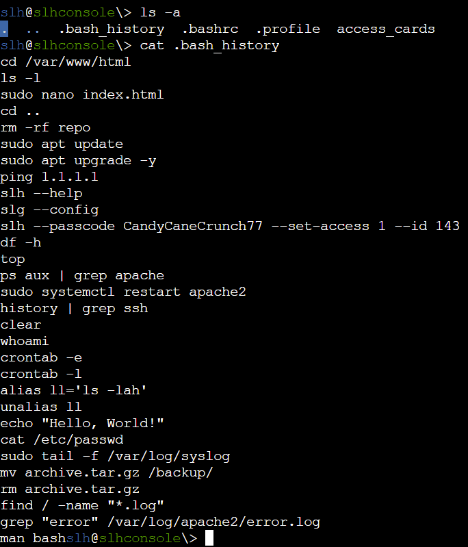
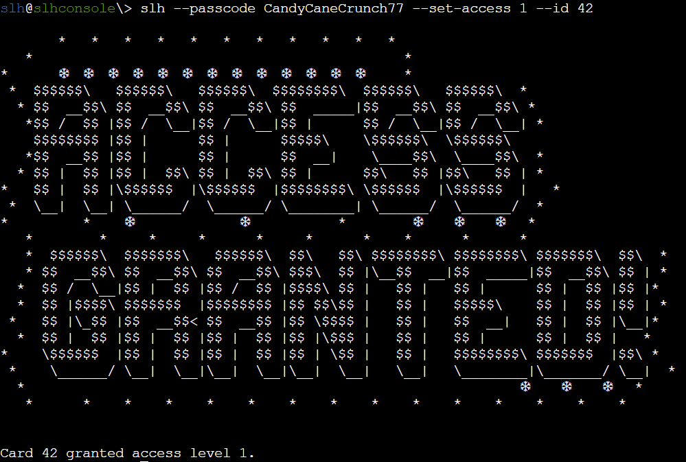
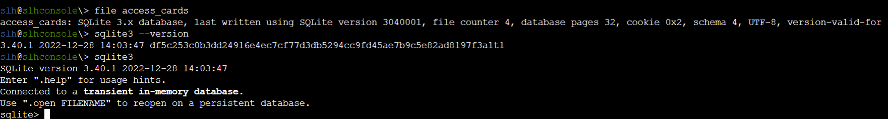
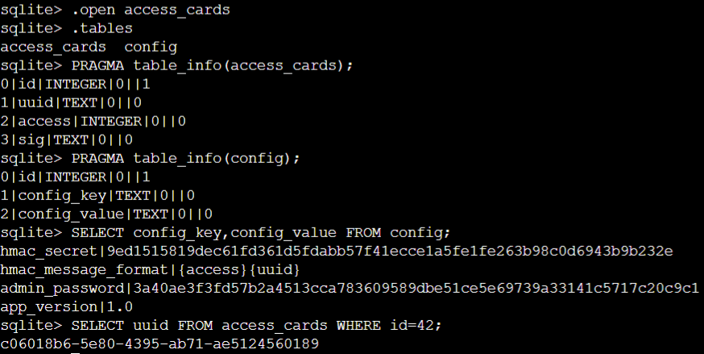
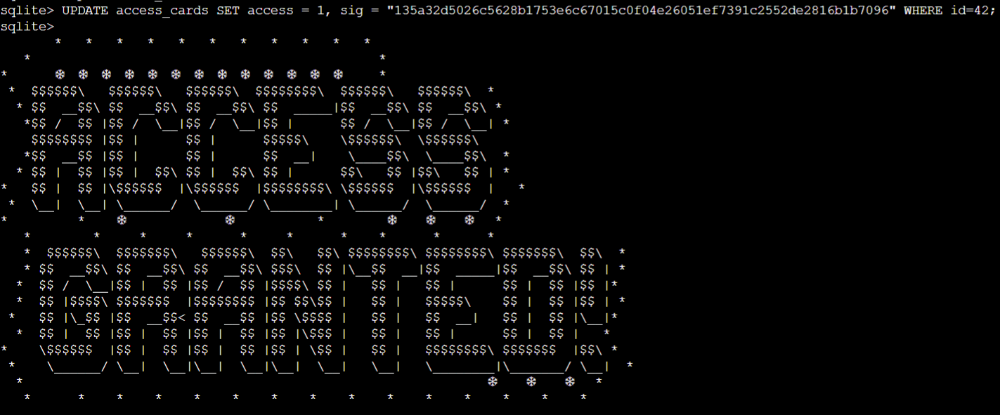

### Hardware Hacking 101 Part 2
Santa’s gone missing, and the only way to track him is by accessing the Wish List in his chest—modify the access_cards database to gain entry!<br>
Solved: Silver, Gold

---

***Hidden in Plain Sight***<br>
From: Jewel Loggins<br>
It is so important to keep sensitive data like passwords secure. Often times, when typing passwords into a CLI (Command Line Interface) they get added to log files and other easy to access locations. It makes it trivial to step back in history and identify the password.

***It's In the Signature***<br>
From: Jewel Loggins<br>
I seem to remember there being a handy HMAC generator included in [CyberChef](https://gchq.github.io/CyberChef/#recipe=HMAC(%7B'option':'UTF8','string':''%7D,'SHA256')).

---

***Jewel Loggins***
> Next, we need to access the terminal and modify the access database. We're looking to grant access to card number 42.<br><br>
Start by using the slh application—that’s the key to getting into the access database. Problem is, the ‘slh’ tool is password-protected, so we need to find it first.<br><br>
Search the terminal thoroughly; passwords sometimes get left out in the open.<br><br>
Once you've found it, modify the entry for card number 42 to grant access. Sounds simple, right? Let’s get to it!

---

#### Silver Solution

First we startup the system and look at all the files in the current folder. Then we view the contents of the `.bash_history` file:



We see that the password is `CandyCaneCrunch77`. We use this passsword to  grant access to the card number 42:



---

***Jewel Loggins***
> Wow! You're amazing at this! Clever move finding the password in the command history. It’s a good reminder about keeping sensitive information secure…<br><br>
There’s a tougher route if you're up for the challenge to earn the Gold medal. It involves directly modifying the database and generating your own HMAC signature.<br><br>
I know you can do it—come back once you've cracked it!


---

#### Gold Solution

We see that the `access_cards` file is a sqlite3 database and that sqlite3 is installed. We open the sqlite3 CLI, allowing us to interact with the `access_cards` database:



In the sqlite3 CLI, we open the `access_cards` database and see that the `access_cards` database has two tables `access_cards` and `config`. The `access_cards` table has columns `id`, `uuid`, `access`, and `sig`. Then `config` table has columns `id`, `config_key`, and `config_value`.

We get the `config_key` and `config_value` from the `config` table. We see that the `hmac_message_format` is `{access}{uuid}`. Now to forge an HMAC, we need the `hmac_secret` from the `config` table and the `uuid` for card number 42 from the `access_cards` table:




We can use [cyberchef](https://gchq.github.io/CyberChef/#recipe=HMAC(%7B'option':'UTF8','string':''%7D,'SHA256')) to forge our HMAC Signature:

```
Key: 9ed1515819dec61fd361d5fdabb57f41ecce1a5fe1fe263b98c0d6943b9b232e
Hashing Function: SHA256
Input: 1c06018b6-5e80-4395-ab71-ae5124560189
Output: 135a32d5026c5628b1753e6c67015c0f04e26051ef7391c2552de2816b1b7096
```


Lastly, we update the sqlite3 database:



---

***Jewel Loggins***
> Brilliant work! We now have access to… the Wish List! I couldn't have done it without you—thank you so much!

---