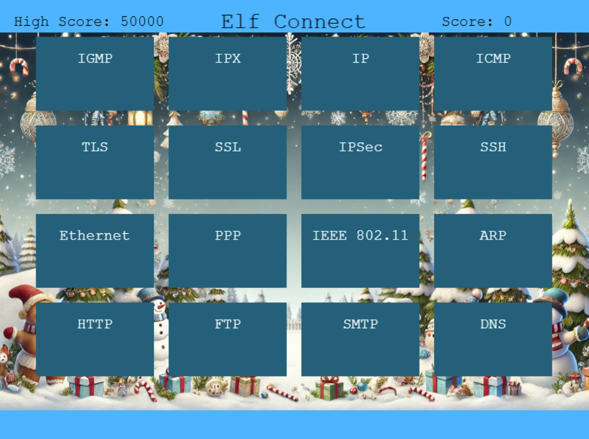

### Elf Connect

Help Angel Candysalt connect the dots in a game of connections
Solved: Silver, Gold

---

***Angel Candysalt***
> Welcome back, island adventurer! I'm Angel Candysalt — so happy to finally meet you!<br><br>
I'm thrilled you're here because I could really use a hand with something.<br><br>
Have you ever heard of a game called Connections?<br><br>
It’s simple! All you need to do is find groups of four related words.<br><br>
I've been stuck on it all day, and I'm sure someone as sharp as you will breeze through it.

---

<div style="text-align: center;"></div>

---
#### Silver Solution
##### Round 1


The overall theme for round 1 seems to be Christmas Themed:

- Holiday Decorations: Tinsel, Garland, Star, Lights
- Christmas Items: Sleigh, Bag, Mittens, Gifts
- Christmas Music/Artists: Belafonte, Jingle Bells, Crosby, White Christmas
- Santa's Reindeer: Comet, Vixen, Prancer, Blitzen

---
##### Round 2


The overall theme for round 2 seems to be Penetration Testing Tools:

- Network Tools: Nmap, netcat, Wireshark, Nessus
- Web Tools: burp, OWASP ZAP, Nikto, wfuzz
- Mobile Tools: Frida, Cycript, AppMon, apktool
- Exploitation Frameworks: Metasploit, Cobalt Strike, HAVOC, Empire

---

##### Round 3


The overall theme for round 3 seems to be Cryptography:

- Modern Ciphers/Algorithms: AES, RSA, Blowfish, 3DES
- Wireless Authentication Protocols: WEP, WPA2, TKIP, LEAP
- Types of Encryption: Symmetric, Asymmetric, hash, hybrid
- Classic Ciphers/Algorithms: Caesar, One-time pad, Ottendorf, Scytale

---

##### Round 4



The overall theme for round 4 seems to be protocols:

- Networking Protocols: IGMP, IPX, IP, ICMP
- Security Protocols: TLS, SSL, IPSec, SSH
- Link Layer 2 Protocols: Ethernet, PPP, IEEE 802.11, ARP
- Application Layer 7 Protocols: HTTP, FTP, SMTP, DNS

---

***Angel Candysalt***
> If you want a more difficult challenge, try beating randomElf's score.

---

#### Gold Solution

Looking at the source code, we see that the high score is 50000.

```JavaScript
// index.html checkSelectedSet(scene)
if (score > 50000) {
    highScoreText.setText('High Score: ' + score);
    emitter.explode(20);
    submitAction(2);
    displaySuccessMessage('Great Job Hacker! Elf Connect Complete and Hacked!', function () {

    });
}
```

We use the Javascript console to change our score to 50001 and then solve a row:

```javascript
> score = 50001;
> selectedBoxes = correctSets[0].map(i => wordBoxes.find(box => box.index === i));
> checkSelectedSet(mainScene);
```

---