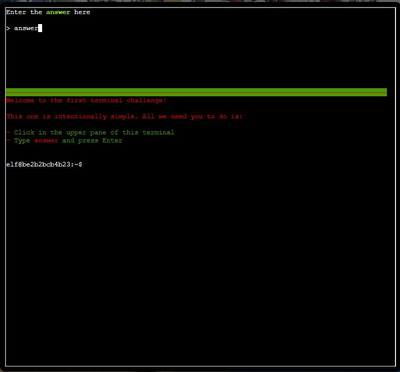

### Holiday Hack Orientation
Talk to Jingle Ringford on Christmas Island and get your bearings at Geese Islands. 
Solved: Silver, Gold
---

***Jingle Ringford***
> Welcome to the Geese Islands and the 2023 SANS Holiday Hack Challenge!  
I'm Jingle Ringford, one of Santa's many elves.  
...  
Just kidding! It's actually the 2024 SANS Holiday Hack Challenge!  
And although we're on Frosty's Beach on Christmas Island, we'll soon be on our way back to the North Pole.  
I thought it best to wait here for people that heard we're on the Geese Islands but may not know we're leaving.   
I haven't seen Santa since we started packing up, but he always asks me to give a quick orientation to newcomers, so I'm continuing the tradition.

---

#### Cranberry Pi Terminal

***Jingle Ringford***
> Now, click on the <b>Cranberry Pi Terminal</b> and follow the on-screen instructions.

---

***Jingle Ringford***
> Well, that's it, now you're orientated! Feel free to get yourself settled in, establish a cohort with others, or just explore this lovely island. Just be careful where you walk as we are moving around some pretty heavy crates.  
Oh, while we're preparing everything to set sail for the North Pole, I heard Poinsettia McMittens and Angel Candysalt could use some assistance. I'm sure they'll appreciate any help you can provide!  
We'll let you know when the boat leaves, but for now relax, enjoy the sun, and most importantly, have FUN!

---