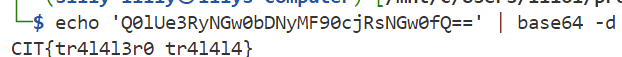

### Brainrot Quiz!

Bombardiro Crocodillo or....? You find out...

Challenge Files: [brainrot.pcap](brainrot.pcap)

---

#### Flag
> CIT{tr4l4l3r0_tr4l4l4}

We can use the `tshark` tool to extract the payloads of each packet:

```bash
$ tshark -r brainrot.pcap -T fields -e data.data
```

We need to convert the payloads to ascii since they are in raw hex format:

```bash
$ tshark -r brainrot.pcap -T fields -e data.data | while read line; do echo "$line" | xxd -r -p; echo; done;
```

Looking at the ascii payloads, we see one that looks as though it's base64 decoded: 

```
szEov37nftaktC3
RGCF4YLGu54kOMF0Ag
2n6fD9wUuksNZLy
jYIpuEN3AGExHkPdKwf
5iPOWMp69dAFw8jhPt
9RvpLT5LCl6nj
Shoutout to our sponsors!
z8kAGPw0sjf
aI6qV21LYh1swwo02V
73QvyPeSCIRTt3TGQj
Q0lUe3RyNGw0bDNyMF90cjRsNGw0fQ==
XOsPzqcApbNTYrp
LiJFmt8GOAalbpmL8c
IWIpKUkuxTJ
O1jTgCnRd3Di
e6mub98PwE3wM02j
edwxXaFNRg5q
yUDnuUdtXg3AZo3vX
4utPtrZK1tHCR88qMEcvCdKKD3ExMZ5vuM
GmcGD6zzp8r
QKavufXWafBfeZqRO
vKuU9wlCM6
Xb3xuBj1X7z
BvcrQ6s2LOo
DR6i3vZPFtxAkZQql
8uPCT8UtvOxes
xuxECKirNVfk
ITjkGln10chK
3ok2fcbPqyI2qmGdxf
YBx2o9Ph7eIE38zyf
```

Lastly, we base64 decode the payload:



---