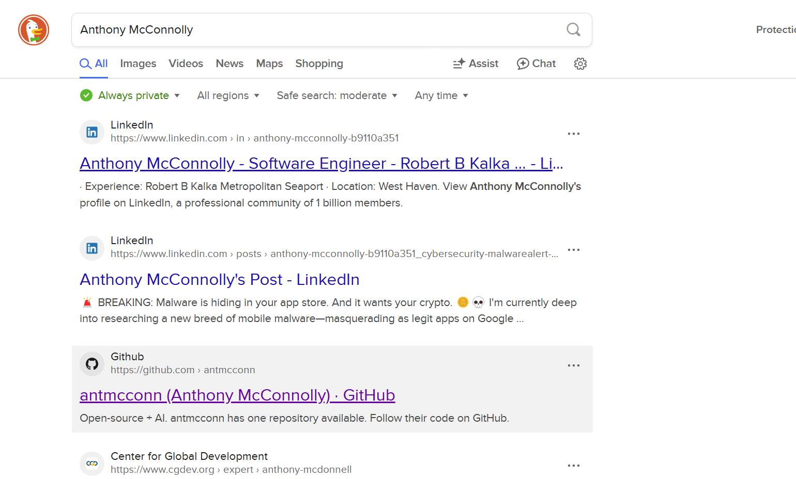
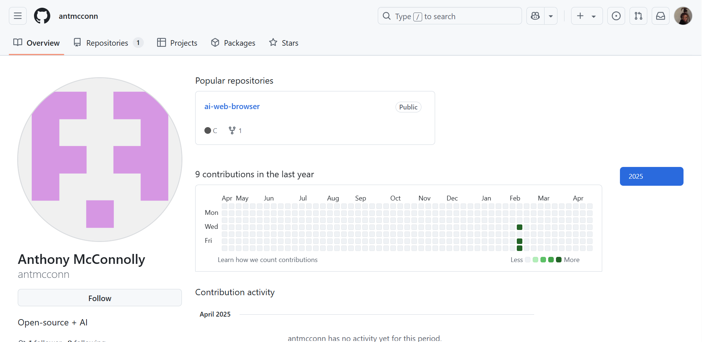
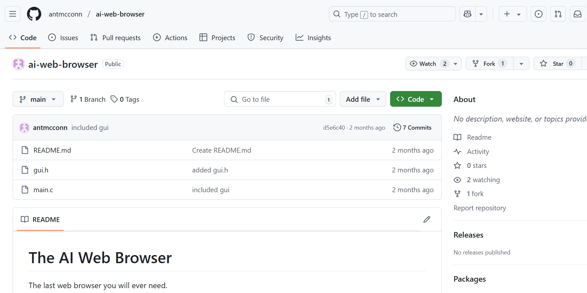
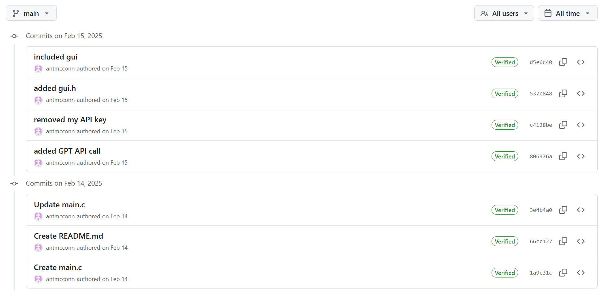
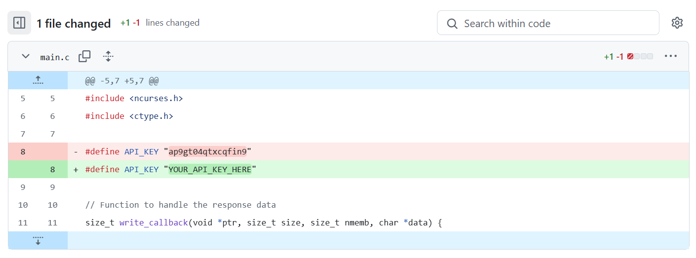

### No Country for Old Keys

What is Anthony McConnolly's API key?

---

#### Flag
> ap9gt04qtxcqfin9

We use Google to Search for `Anthony McConnolly`:

We find a [GitHub account](https://github.com/antmcconn) with the name `Anthony McConnolly`:

The GitHub account only has one repository [`ai-web-browser`](https://github.com/antmcconn/ai-web-browser):

Looking at the [previous commits](https://github.com/antmcconn/ai-web-browser/commit/c4138bedbaf2f0f04691a79045672bc815ca35d3), we see a commit that removed an API Key:

Looking at that commit, we see that the commit removed the line `#define API_KEY "ap9gt04qtxcqfin9"`:

---