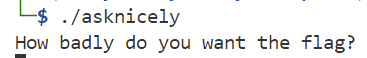
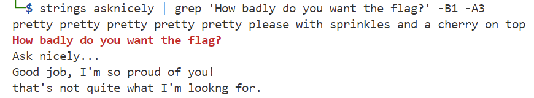
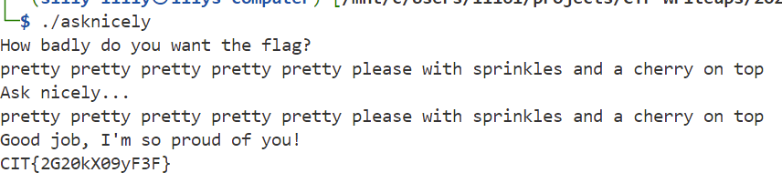

### Ask Nicely
I made this program, you just have to ask really nicely for the flag!

Challenge Files: [asknicely](asknicely)

---

#### Flag
> CIT{2G20kX09yF3F}

We run the executable:

The executable asks us: `How badly do you want the flag?`. We use `strings` to find all readable characters in the executable and `grep` to search for that sentence. We retrieve 1 line before the sentence, the sentence, and 3 lines after the sentence:

We use the retrieved password to get the flag:

---