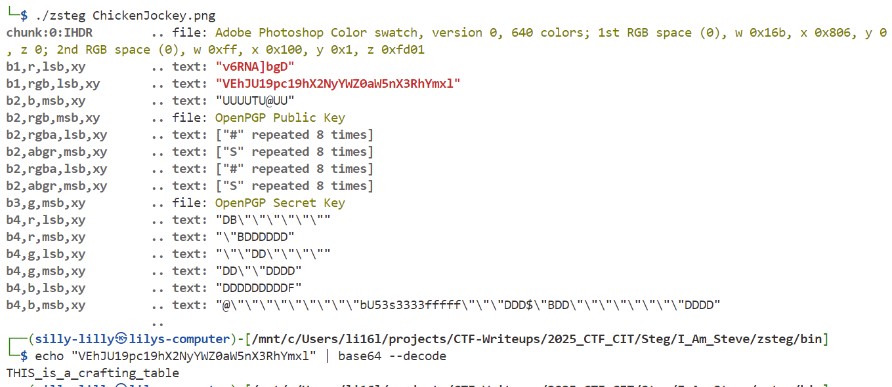

### I AM Steve
You were supposed to be a hero, Brian!

SHA256: 01b3dbe5d8801adf27a9bb779d85ef4c8881905544642fbdbdd41e54e4d0ae5e

Challenge Files: [ChickenJockey.png](ChickenJockey.png)

---

#### Flag
> CIT{THIS_is_a_crafting_table}

We use find base64 text hidden in the `b1,rgb,lsb,xy` bit plane:

---