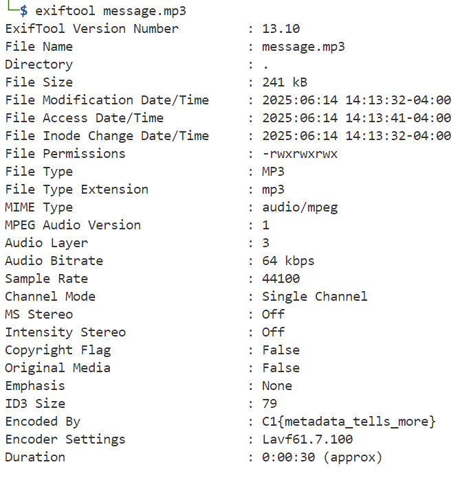

### Behind the Beat
Agents intercepted an audio file named message.mp3. It plays a single tone, but we have intel that a flag might be tucked away in the metadata fields of the file. Can you inspect the file and uncover the flag?

Challenge Files: [message.mp3](message.mp3)

---

#### Flag
> C1{metadata_tells_more}

We can use the `exiftool` to view the file metadata:

---