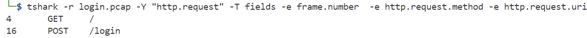
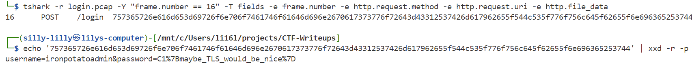

### Packet Whisperer

Our blue team intercepted a network capture file. It contains unencrypted HTTP traffic. While skimming through it, analysts believe someone accidentally exposed their login credentials in plain text. Review the PCAP to find the password that the user logged in with.

Challenge Files: [login.pcap](login.pcap)

---

#### Flag
> C1{maybe_TLS_would_be_nice}

We use the `tshark` tool to find all of the `HTTP` Requests in the `login.pcap` file:

We see that packet `16` is an `HTTP POST` Request to the `/login` endpoint. We use `tshark` to extract the `HTTP POST` Request data and use `xxd` to decode it:

---