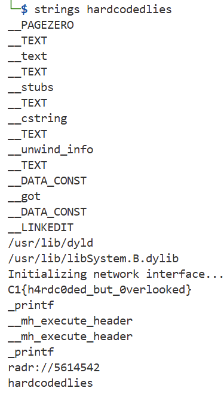

### Hardcoded Lies

The malware sample doesn’t appear to print anything useful. But our threat intel team believes it holds a hardcoded configuration string. Can you pull on some strings to retrieve it?

Challenge Files: [hardcodedlies](hardcodedlies)

---

#### Flag
> C1{h4rdc0ded_but_0verlooked}

We can use the `strings` tool to view printable characters:

---