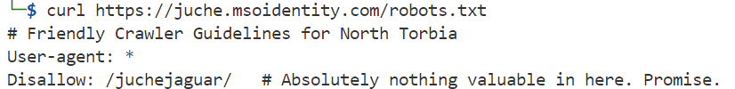
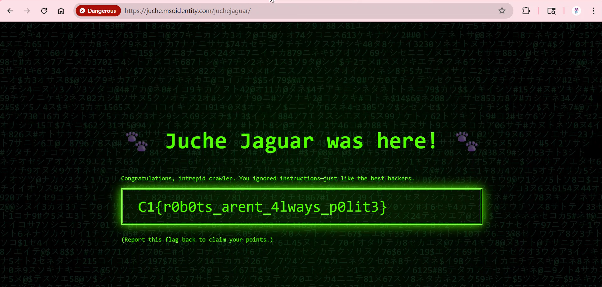

### Secret.txt Society

Our team suspects that a Juche Jaguar developer accidentally left something interesting behind on a public site. You’ve been tasked with examining its structure. Can you uncover what the bots were told to ignore? Start with the usual entry points a crawler might explore. One disallowed path leads to a page where someone left behind more than just code.

---

#### Step 1

The `robots.txt` file used by websites prevent web crawlers and bots from accessing or indexing parts of the website. Visiting, the `/robots.txt` file, we find that it's blocking access to the `/juchejaguar` folder:

---

#### Flag
> C1{r0b0ts_arent_4lways_p0lit3}

We visit the `/juchejaguar` folder and find the flag:

---