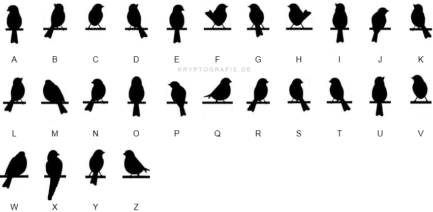
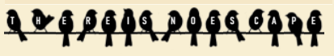

### The Birds
You think you're being watched, and you see a suspicious flock of birds on the powerlines outside of your house each morning. You think the feds are trying to tell you something. Separate words with underscores and encase in DawgCTF{}. All lowercase.

Challenge Files: [burb.png](burb.png)

---

#### Flag
> DawgCTF{there_is_no_escape}

The picture is encrypted using the Birds on a Wire Cipher:

We Birds on a Wire Cipher is a substitution cipher where each letter corresponds to a picture of a bird:

We can decrypt by mapping each bird to a letter:

---
