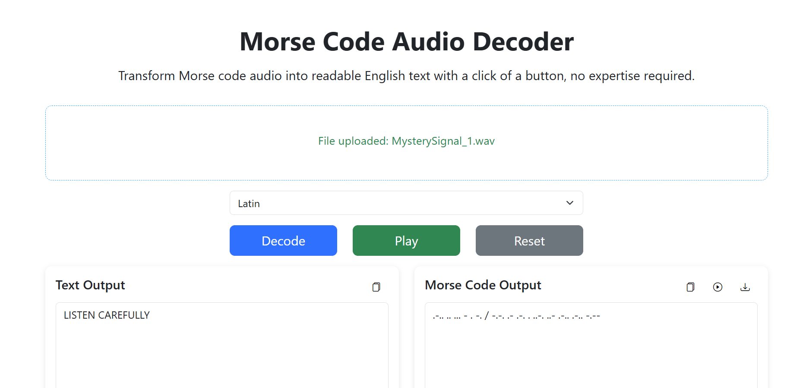

### Mystery Signal I
I was listening to my scanner when I heard a strange signal. Can you decode it?

Challenge Files: [MysterySignal_1.wav](MysterySignal_1.wav)

---

#### Flag
> DawgCTF{LISTENCAREFULLY}

The flag is encoded using morse code. We can use an [online morse code decoder](https://dimorse.com/morse-code-audio-decoder/) to decode the flag:

---