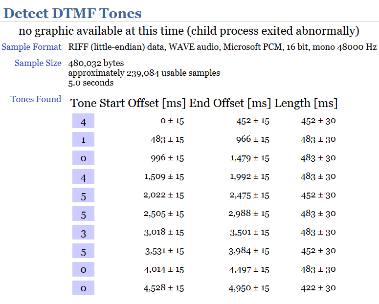

### Don't Touch My Fone
Looks like someone's dialing a phone number, see if you can figure out what it is! The flag format is the decoded phone number wrapped in DawgCTF{} with no formatting, so if the number is 123-456-7890, then the flag is DawgCTF{1234567890}.

Challenge Files: [Don't Touch My Fone_dtmf.wav](Don't_Touch_My_Fone_dtmf.wav)

---

#### Flag
> 	DawgCTF{4104553500}

The challenge file contains a recording of DTMF tones which is the sound produced when you press a button on a telephone keypad. We can use an online [DTMF Tone Detector](http://www.dialabc.com/sound/detect/index.html) to decode the phone number:

---