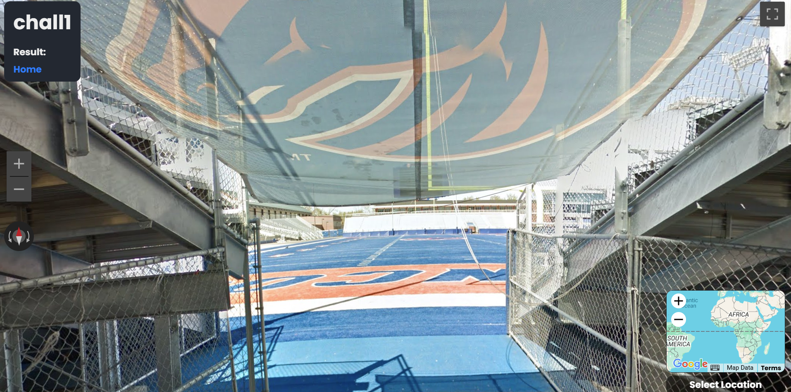
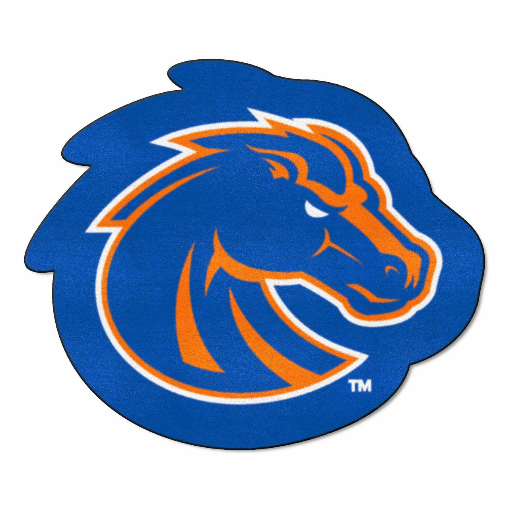

### GEOSINT - chall1
Go to the website, find the locations, and click on the location to receive the flag!

---

#### Flag
> DawgCTF{Im-more-of-a-bama-fan}

Looking at the geosint platform, we see a football arena with a horse mascot, blue and orange team colors, and the letters "NCO" visible. 



A quick google search tells us that Boise State University in Idaho has a horse mascot named Buster Bronco and blue and orange team colors:



Albertsons Stadium is Boise State's football arena and the Allen Noble Hall Of Fame is at the end of the stadium and where the location is:

```
Allen Noble Hall Of Fame
1910 W University Dr
Boise, ID 83725
```

---