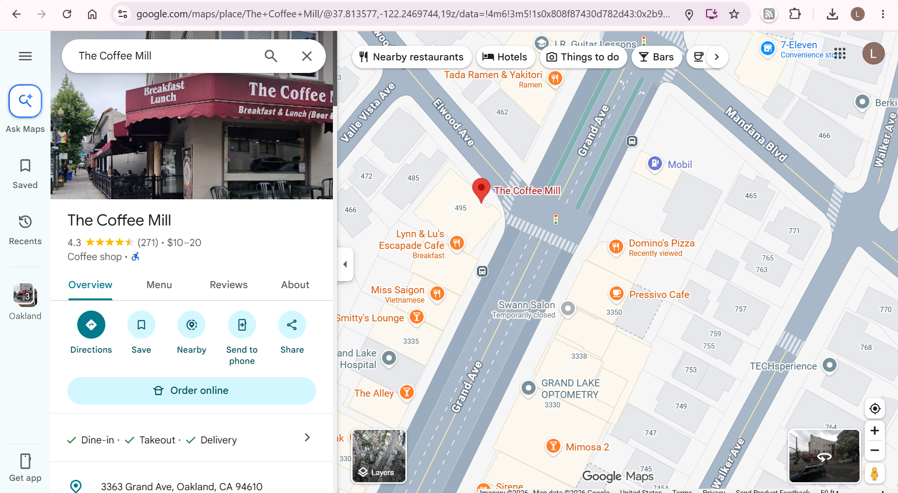
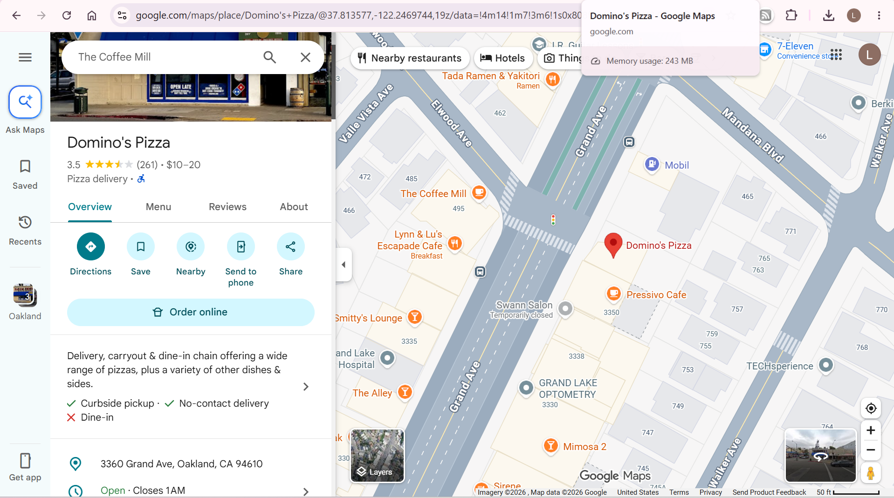

### Digital Crumbs
My friends just sent me this picture of a coffee place they were at and told me to meet them at the pizza store across the street. What is the building number of that pizza shop?  
Hint: Flag should be in the format bronco{XXXX}, where XXXX is the building number.

Challenge Files: [CoffeeMill.jpg](CoffeeMill.jpg)

---

#### Flag
> bronco{3360}

Looking at the challenge file, we see a picture of a coffee shop called `The Coffee Mill` with a sign calling it `Oakland's Oldest Coffee Shop`:

We use Google Maps to search for the coffee shop:

Across from the coffee shop is a Domino's Pizza with the street address `3360 Grand Ave, Oakland, CA 94610`:

---

