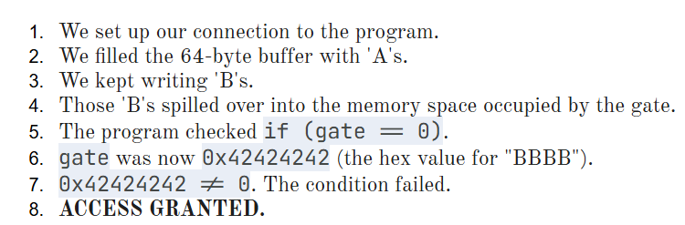
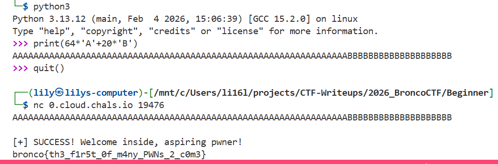

### Pwntorial
I've gotten complaints that BroncoCTF has no PWN. But, I think the more important issue is that our students don't know HOW to PWN!

Behold: the PWNTORIAL. This'll solve all your pwn knowledge holes!

[Google Docs: The Pwntorial](https://docs.google.com/document/d/e/2PACX-1vTCF6gP7mStNb8FYbWCk6cDHn7wk3XtcnfA2VH25D-LXXDX6brC-DqyK-bNriCYdxk9nXAUgPLBfnuT/pub)

*...yeah it's just an AI Slop Google Doc but surely that's enough to educate college students nowadays, right?*

---

#### Flag
> bronco{th3_f1r5t_0f_m4ny_PWNs_2_c0m3}

According to the `The Pwntorial`, we need to:

We can use python to make our payload and then the `nc` tool to send our payload to the target:

---

