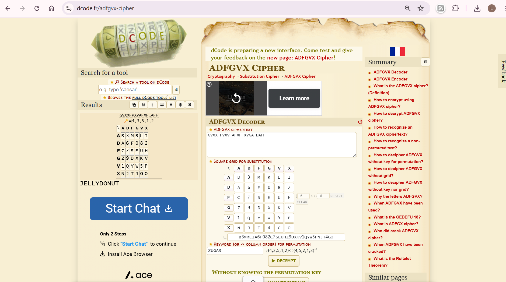

### Grandma's Secret
Grandma wants to protect her wifi password. Can you find out what it is before grandpa does?

Challenge Files: [Letter.jpeg](Letter.jpeg)

---

#### Flag
> bronco{JELLYDONUT}

Reading Grandma's letter, we find its the ADFGVX Cipher with the square grid `B3MRLIA6F082C7SEUHZ9DXKV1QYW5PNJT4GO` and keyword `SUGAR`:

We can use the online tool for the [ADFGVX Cipher](https://www.dcode.fr/adfgvx-cipher):

---