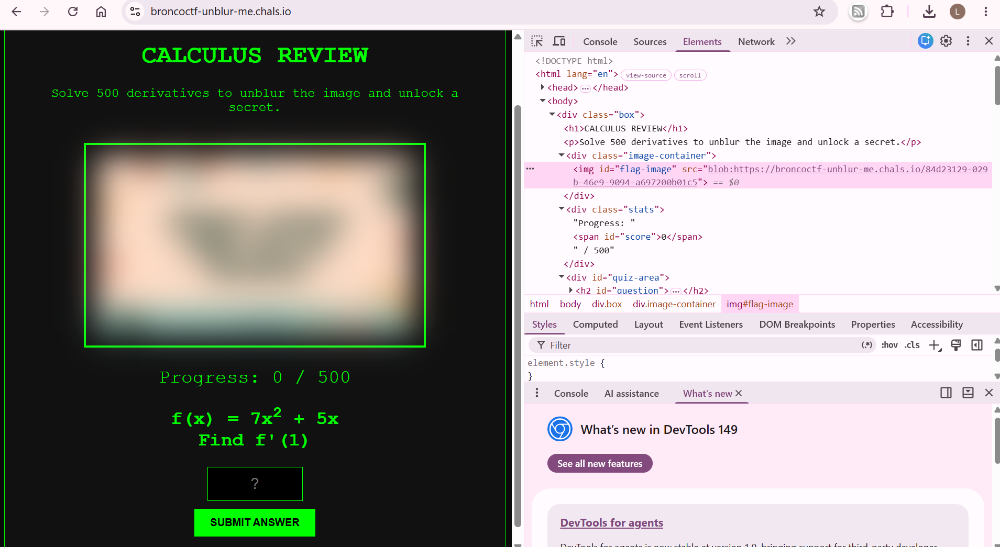
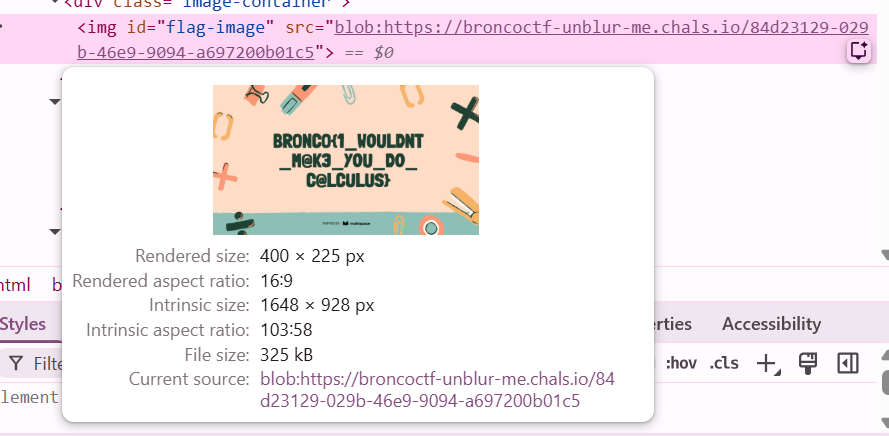

### Unblur Me
My friend tried to motivate me to review my derivatives by telling that me that I can unlock a top-secret image after I solve 500 challenges on this website. Unfortunately for her, I'm a firm believer in work smarter not harder, so I wonder if there's a way I can get the flag without actually doing any math?

---

#### Flag
> bronco{1_WOULDNT_M@K3_YOU_DO_C@LCULUS}

Looking at the underlying html of the website, we find the actual url of the flag image being stored:

We can use this url to get the flag:

---