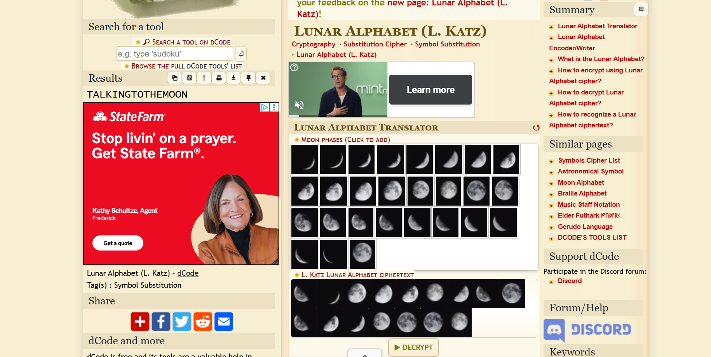

### ArtIsMissed II
From a successful lunar mission conducted by THEM?! Space agency, they recovered few lunar images from ninjahere camera module, but they noticed that they found something more than just images! can you uncover it?

Flag format: THEM?!CTF{} (all uppercase)

Challenge Files: [Artismissed.png](Artismissed.png)

---

#### Flag
> THEM?!CTF{TALKINGTOTHEMOON}

The cipher is the Lunar Alphabet (L. Katz) cipher. Using the [online L. Katz tool](https://www.dcode.fr/lunar-alphabet-leandro-katz), we have:

---