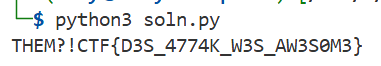

### D3Spacito
lowkey despacito....

Challenge Files: [ques.py](ques.py), [output.txt](output.txt)

---

#### Encryption
Looking at the challenge files, `ques.py` encrypts the flag and `output.txt` is the resulting encrypted flag. First the flag is padded and then it is encrypted:

```python
# ques.py
plaintext = pad(flag)
print(enc(plaintext, key).decode())
```

For the padding function, the character `*` is added to the end of the plaintext until the length is divisible by `8`:

```python
# ques.py
def pad(plaintext):
    while len(plaintext) % 8 != 0:
        plaintext += b"*"
    return plaintext
```

For the encryption function, the plaintext is encrypted using Data Encryption Standard (DES) in ECB mode and then base64 encoded:

```python
def enc(plaintext, key):
    cipher = DES.new(key, DES.MODE_ECB)
    return base64.b64encode(cipher.encrypt(plaintext))
```

---

#### Flag
> THEM?!CTF{D3S_4774K_W3S_AW3S0M3}

Since DES in a symmetric-key algorithm, the same key is used for encryption and decryption and must be kept secret. However, they key is hardcoded in `ques.py`:

```python
# ques.py
key = bytes.fromhex("E1E1E1E1F0F0F0F0")
```

We can use this key to recover the flag. First we decrypt the DES and then we unpad the flag:

```python
# soln.py
ciphertext = "T/tGpZNyHdhnf1oxwRmMPFcLiH//AfZdTpmYdp8daU0="
key = bytes.fromhex("E1E1E1E1F0F0F0F0")

print(unpad(dec(ciphertext=ciphertext,key=key).decode()))
```

The `dec()` function base64 decodes the ciphertext and decrypts it using the DES cipher.

```python
# soln.py
def dec(ciphertext, key):

    cipher = DES.new(key, DES.MODE_ECB)
    return cipher.decrypt(base64.b64decode(ciphertext))
```

The `unpad()` function removes the trailing `*` from the plaintext:

```python
# soln.py
def unpad(plaintext):

    return plaintext.rstrip("*")
```



---