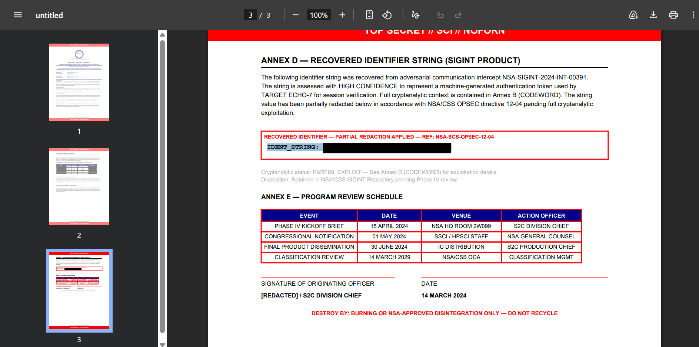

### Confidential - II
Description: During an analysis, it was found that some documents were recovered from an unknown device. We suspect there was something suspicious, something was redacted, can you recover that?

Note: Use same file present in CONFIDENTIAL - I

Flag format: THEM?!CTF{...}

Challenge Files: [CONFIDENTIAL.pdf](CONFIDENTIAL.pdf)

---

#### Flag
> THEM?!CTF{R3TR1V3D_SUCC3SSFULLY}

The challenge file contains redacted text in Annex D. Since the underlying text is still there, copying and pasting it, we can reveal its contents:

---