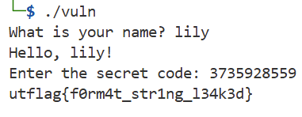

### Hour of Joy
This program is very friendly. It just wants to say hello. Nothing suspicious going on here at all. Download the binary and run it locally. By Garv (@GarvK07 on discord)

Challenge Files: [vuln](vuln)

---
#### Flag
> utflag{f0rm4t_str1ng_l34k3d}

Using `objdump` we can disassemble the binary:

```
00000000000012cb <main>:
    12cb:       f3 0f 1e fa             endbr64
    12cf:       55                      push   %rbp
    12d0:       48 89 e5                mov    %rsp,%rbp
    12d3:       48 83 ec 60             sub    $0x60,%rsp
    12d7:       b8 00 00 00 00          mov    $0x0,%eax
    12dc:       e8 28 ff ff ff          call   1209 <setup>
    12e1:       c7 45 fc ef be ad de    movl   $0xdeadbeef,-0x4(%rbp)
    12e8:       48 8d 05 15 0d 00 00    lea    0xd15(%rip),%rax        # 2004 <_IO_stdin_used+0x4>  
    12ef:       48 89 c7                mov    %rax,%rdi
    12f2:       b8 00 00 00 00          mov    $0x0,%eax
    12f7:       e8 d4 fd ff ff          call   10d0 <printf@plt>
    12fc:       48 8b 15 1d 2d 00 00    mov    0x2d1d(%rip),%rdx        # 4020 <stdin@GLIBC_2.2.5>  
    1303:       48 8d 45 b0             lea    -0x50(%rbp),%rax
    1307:       be 40 00 00 00          mov    $0x40,%esi
    130c:       48 89 c7                mov    %rax,%rdi
    130f:       e8 dc fd ff ff          call   10f0 <fgets@plt>
    1314:       48 8d 45 b0             lea    -0x50(%rbp),%rax
    1318:       48 8d 15 f9 0c 00 00    lea    0xcf9(%rip),%rdx        # 2018 <_IO_stdin_used+0x18> 
    131f:       48 89 d6                mov    %rdx,%rsi
    1322:       48 89 c7                mov    %rax,%rdi
    1325:       e8 b6 fd ff ff          call   10e0 <strcspn@plt>
    132a:       c6 44 05 b0 00          movb   $0x0,-0x50(%rbp,%rax,1)
    132f:       48 8d 05 e4 0c 00 00    lea    0xce4(%rip),%rax        # 201a <_IO_stdin_used+0x1a> 
    1336:       48 89 c7                mov    %rax,%rdi
    1339:       b8 00 00 00 00          mov    $0x0,%eax
    133e:       e8 8d fd ff ff          call   10d0 <printf@plt>
    1343:       48 8d 45 b0             lea    -0x50(%rbp),%rax
    1347:       48 89 c7                mov    %rax,%rdi
    134a:       b8 00 00 00 00          mov    $0x0,%eax
    134f:       e8 7c fd ff ff          call   10d0 <printf@plt>
    1354:       48 8d 05 c7 0c 00 00    lea    0xcc7(%rip),%rax        # 2022 <_IO_stdin_used+0x22> 
    135b:       48 89 c7                mov    %rax,%rdi
    135e:       e8 5d fd ff ff          call   10c0 <puts@plt>
    1363:       48 8d 05 ba 0c 00 00    lea    0xcba(%rip),%rax        # 2024 <_IO_stdin_used+0x24> 
    136a:       48 89 c7                mov    %rax,%rdi
    136d:       b8 00 00 00 00          mov    $0x0,%eax
    1372:       e8 59 fd ff ff          call   10d0 <printf@plt>
    1377:       48 8d 45 ac             lea    -0x54(%rbp),%rax
    137b:       48 89 c6                mov    %rax,%rsi
    137e:       48 8d 05 b7 0c 00 00    lea    0xcb7(%rip),%rax        # 203c <_IO_stdin_used+0x3c> 
    1385:       48 89 c7                mov    %rax,%rdi
    1388:       b8 00 00 00 00          mov    $0x0,%eax
    138d:       e8 7e fd ff ff          call   1110 <__isoc99_scanf@plt>
    1392:       8b 55 ac                mov    -0x54(%rbp),%edx
    1395:       8b 45 fc                mov    -0x4(%rbp),%eax
    1398:       39 c2                   cmp    %eax,%edx
    139a:       75 0c                   jne    13a8 <main+0xdd>
    139c:       b8 00 00 00 00          mov    $0x0,%eax
    13a1:       e8 aa fe ff ff          call   1250 <print_flag>
    13a6:       eb 0f                   jmp    13b7 <main+0xec>
```

In the main function, we see that a hardcoded value is stored in memory:

```
movl   $0xdeadbeef,-0x4(%rbp)
```

The secret code is read using the `scanf()` function. Since we want the memory value to be `$0xdeadbeef` and `scanf()` uses a decimal format string, the program is expecting the decimal value `3735928559`: 



---