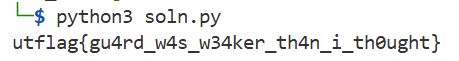

### Rude Guard
There's a guard that's protecting the flag! How do I sneak past him?

By Joel (@jayscx on discord)

Challenge Files: [pwnable](pwnable)

---

#### Secret Function

Using `objdump` we disassemble `secret_function()` and see that 5 hardcoded values are XORed with `0x32`:

```000000000040124f <secret_function>:
  40124f:       55                      push   %rbp
  401250:       48 89 e5                mov    %rsp,%rbp
  401253:       48 83 ec 40             sub    $0x40,%rsp
  401257:       c6 45 fb 32             movb   $0x32,-0x5(%rbp)
  40125b:       48 b8 47 46 54 5e 53    movabs $0x554955535e544647,%rax
  401262:       55 49 55
  401265:       48 ba 47 06 40 56 6d    movabs $0x4106456d56400647,%rdx
  40126c:       45 06 41
  40126f:       48 89 45 c0             mov    %rax,-0x40(%rbp)
  401273:       48 89 55 c8             mov    %rdx,-0x38(%rbp)
  401277:       48 b8 6d 45 01 06 59    movabs $0x6d4057590601456d,%rax
  40127e:       57 40 6d
  401281:       48 ba 46 5a 06 5c 6d    movabs $0x466d5b6d5c065a46,%rdx
  401288:       5b 6d 46
  40128b:       48 89 45 d0             mov    %rax,-0x30(%rbp)
  40128f:       48 89 55 d8             mov    %rdx,-0x28(%rbp)
  401293:       48 b8 46 5a 02 47 55    movabs $0x4f465a5547025a46,%rax
  40129a:       5a 46 4f
  40129d:       48 89 45 df             mov    %rax,-0x21(%rbp)
  4012a1:       c7 45 f4 27 00 00 00    movl   $0x27,-0xc(%rbp)
  4012a8:       c7 45 fc 00 00 00 00    movl   $0x0,-0x4(%rbp)
  4012af:       eb 1b                   jmp    4012cc <secret_function+0x7d>
  4012b1:       8b 45 fc                mov    -0x4(%rbp),%eax
  4012b4:       48 98                   cltq
  4012b6:       0f b6 44 05 c0          movzbl -0x40(%rbp,%rax,1),%eax
  4012bb:       32 45 fb                xor    -0x5(%rbp),%al
  4012be:       0f b6 c0                movzbl %al,%eax
  4012c1:       89 c7                   mov    %eax,%edi
  4012c3:       e8 68 fd ff ff          call   401030 <putchar@plt>
  4012c8:       83 45 fc 01             addl   $0x1,-0x4(%rbp)
  4012cc:       8b 45 fc                mov    -0x4(%rbp),%eax
  4012cf:       3b 45 f4                cmp    -0xc(%rbp),%eax
  4012d2:       7c dd                   jl     4012b1 <secret_function+0x62>
  4012d4:       b8 00 00 00 00          mov    $0x0,%eax
  4012d9:       c9                      leave
  4012da:       c3                      ret
```

---

#### Flag
> utflag{gu4rd_w4s_w34ker_th4n_i_th0ught}

We extract the 64-bit blocks containing the flag bytes. Convert each block to little-endian byte order, as stored in memory. XOR each byte with the key 0x32, matching the binary’s secret_function loop. Take only the first 40 bytes, ignoring extra padding in the last block.

```python
# soln.py
# Encoded flag bytes from secret_function (little-endian)
encoded = [
    b'\x47\x46\x54\x5e\x53\x55\x49\x55'
    b'\x47\x06\x40\x56\x6d\x45\x06\x41',
    b'\x6d\x45\x01\x06\x59\x57\x40\x6d',
    b'\x46\x5a\x06\x5c\x6d\x5b\x6d\x46',
    b'\x5a\x02\x47\x55\x5a\x46\x4f'
]

key = 0x32
flag_bytes = []

# XOR each byte, stop exactly at 40 bytes
for block in encoded:
    for b in block:
        flag_bytes.append(b ^ key)

flag = ''.join(map(chr, flag_bytes))
print(flag)

```



---