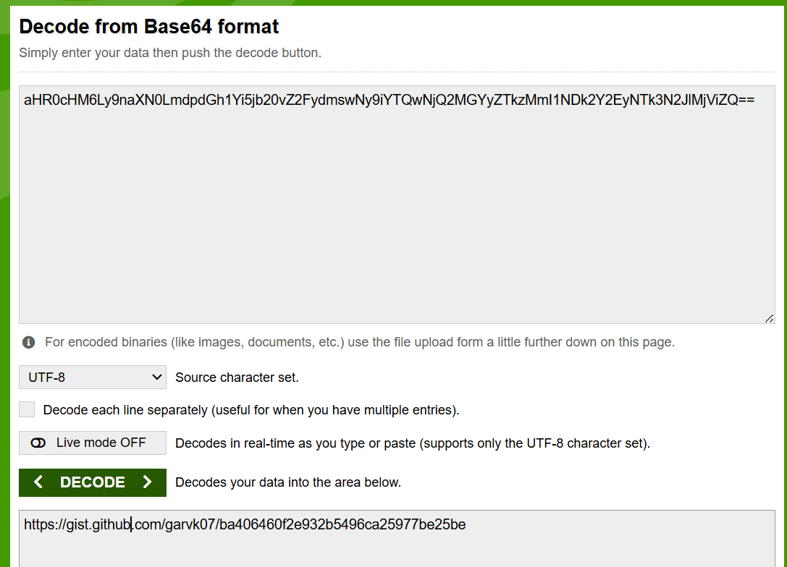
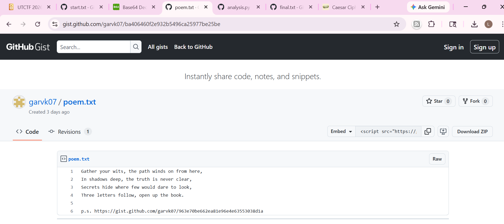
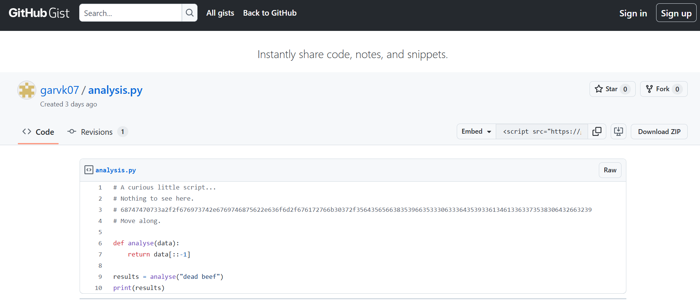
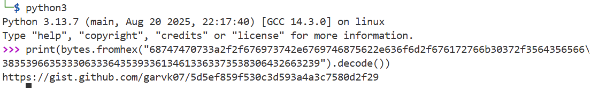
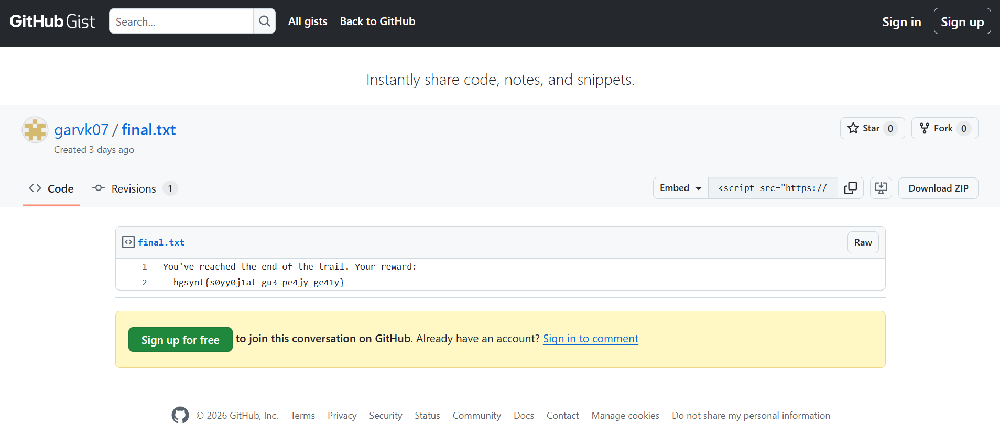
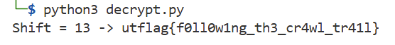

### Breadcrumbs
Every trail has a beginning. This one starts here: [https://gist.github.com/garvk07/3f9c505068c011e0fd6abd9ddf56aecb](https://gist.github.com/garvk07/3f9c505068c011e0fd6abd9ddf56aecb) Follow the breadcrumbs. The flag is at the end. By Garv (@GarvK07 on discord)

---

#### Base 64

We visit the webpage in the challenge description:


The webpage has a base64 string on it. We decode the string to get the next webpage:



---

#### Poem

We reach the second page:



---

#### Analyzer Page

We follow the link on the Poem Page to get to the analyzer page:



Next we decode the hex value to readable ascii:



---

#### Encrypted Flag

We visit the next page to get the encrypted flag:



---


#### Flag
> utflag{f0ll0w1ng_th3_cr4wl_tr41l}

The flag is encrypted using caesar cipher:

```python
def caesar_decode(s, shift):
    result = ""
    for c in s:
        if 'a' <= c <= 'z':
            result += chr((ord(c)-ord('a') - shift) % 26 + ord('a'))
        elif 'A' <= c <= 'Z':
            result += chr((ord(c)-ord('A') - shift) % 26 + ord('A'))
        else:
            result += c
    return result

encoded = "hgsynt{s0yy0j1at_gu3_pe4jy_ge41y}"

# Try shift values until the prefix becomes utflag
for shift in range(26):
    decoded = caesar_decode(encoded, shift)
    if decoded.startswith("utflag"):
        print("Shift =", shift, "->", decoded)
        break

```



---