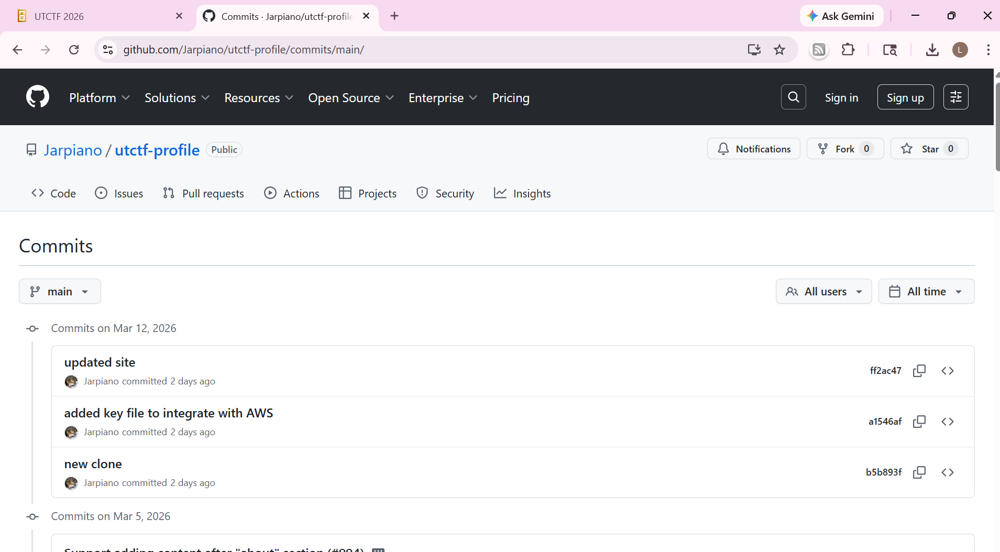

### Double Check
We're planning on deploying some new static sites for our officers. We've cloned a template from Hugo's Static Site Generator (SSG). Can you make sure that our website is clean before it's deployed?

https://github.com/Jarpiano/utctf-profile

By Jared (@jarpiano on discord)

---

#### Flag
> utflag{n07h1n6_70_h1d3}
We visit the website in the challenge description:

We look at previous commits:

We see that a secret AWS key was submitted which is the flag:

---